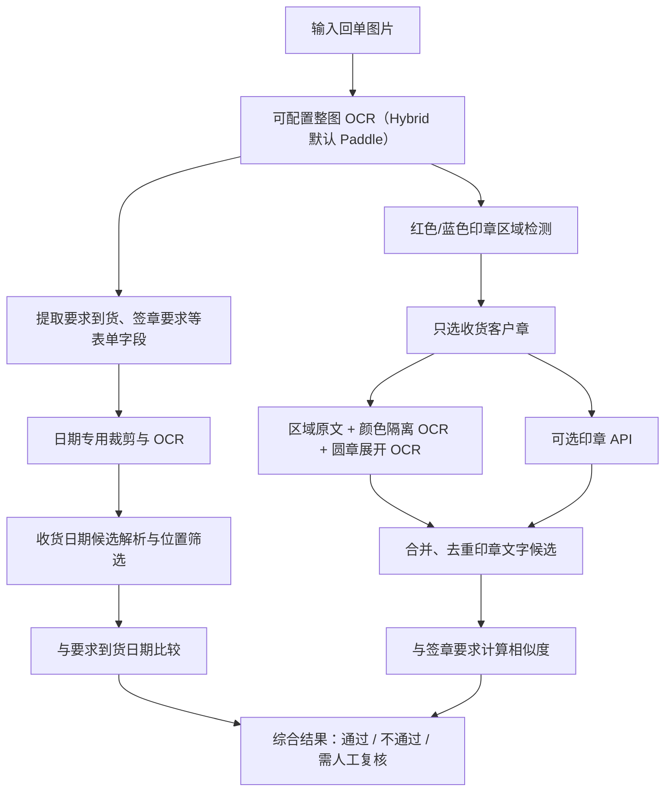

# 日期识别、印章识别与匹配比较逻辑说明

> 本文档描述的是当前代码中已实现的逻辑，不是理想方案或后续规划。关键实现位于 `receipt_ocr/analyzer.py`、`receipt_ocr/parser.py`和 `receipt_ocr/image_processing.py`。

## 当前权威验收快照（2026-08-15）

后文保留各批次演进记录；如历史段落中的累计数字与本节不同，以本节和
`storage/accuracy-report-301-hybrid-tier44.json` 为准。301 张标准回单当前为：字段
`3010/3010`、商品单元格 `2817/2817`、商品整行 `313/313`、日期值
`218/301`（有日期样本检出 `220/300`）、可靠日期 `190/301`（63.12%）且
`190/190` 正确、印章严格结论 `220/301`（73.09%）、印章可靠结论
`219/301`（72.76%）且 `219/219` 正确；完整测试 `357 passed`。当前权威报告为
`storage/accuracy-report-301-hybrid-tier44.json`。

第四十四梯队增加人工真值参考章的“超高支持度局部覆盖”独立路线。
它不修改严格、高内点率或高支持度原路线；候选与参考必须签章要求完全
一致、无完整公司名冲突，并同时达到良好匹配数 145、RANSAC 内点 105、
内点率 70%、候选和参考章面双向覆盖各 24%。任一条件不足即拒绝。

301 张真值矩阵仅新命中 `7289048988.jpg`：与 `7279799198.jpg` 形成
152/107 个匹配/内点、70.39% 内点率、24.40%/51.10% 覆盖；已知错章
`7286691343.jpg` 只有 46/24 个匹配/内点，`7273687654.jpg` 则被公司名
冲突硬阻断，错误放行为 0。真实三张 Hybrid 回归中目标章以 92.1% 可靠
匹配，两个错章都不自动通过；目标日期证据仍不足，整单保持待复核。
全量印章可靠覆盖升至 219/301，219/219 正确；剩余 82 张不可靠印章
继续进入人工复核。界面会并排展示当前章、人工真值参考章、路线名称和所有
几何指标。

第四十三梯队给第四十二梯队的月份组件共识增加平台来源硬门槛。紧凑区域中间证据
必须明确记录主引擎为 macOS Vision、辅助引擎为 Paddle，才允许继续检查 Mobile/
Server 的年份、月份窄槽和显式日。纯 Paddle、Windows/Linux Hybrid 回退或缺少
辅助来源时直接返回无候选；这条检查位于结论组装函数内部，不依赖前端选择文字。
对应单模型反例和 Windows 模拟均已加入自动化测试。

真实 macOS Hybrid 复跑 `7266220440.jpg` 后，完整年份/月份窄槽/显式日证据仍齐全，
结果保持 `2025-01-05`、84% 可靠匹配，整单通过。单张任务 1/1 成功，字段 10/10、
商品单元格 9/9、商品行 1/1、日期和印章均 1/1；中间图文件、HTTP、前后端契约
缺失为 0。Windows 模拟自检为默认 Paddle Mobile、Hybrid page/date/seal 全部
Paddle Mobile、Vision 不可用、安全策略非空、失败项 0；命令现支持 `--output`
写出可审计 JSON。

同轮审计 `7302125543.jpg` 的远下方 `YYYY.M.D` 笔迹。七种完整行预处理未形成
跨模型同日：Mobile 重复读到 `2025.8.5`，Server 的完整候选为 `2025.8.3`；
连通域隔离最后一位后，Mobile 在原图/最大通道图均输出 `5`，Server 均无数字，
Vision 合成窄图也无可用结果。该路线接受 0，生产逻辑未改变，样本继续待复核。
报告为 `storage/date-preprocessing-tier43-7302125543.json`、
`storage/far-lower-date-component-tier43-7302125543.json`、
`storage/windows-smoke-tier43.json`、
`storage/e2e-date-component-platform-gate-tier43.json`、
`storage/accuracy-report-301-hybrid-tier43.json` 和
`storage/date-gap-analysis-tier43-final.json`。

第四十二梯队增加固定日期模板的“完整年份 + 月份数字窄槽 + 显式日”组件共识。
该路线针对年/月之间的细竖笔月份与印章或表格粘连、整行 OCR 丢失月份的场景。
系统从紧凑日期行按固定模板单独保存年/月之间的月份数字原图，并以 RGB 最大通道
抑制彩色印章后放大；原图和处理图都通过中间图接口保存并在复核界面展示。

自动接受不读取要求到货日期来补任何组件。Paddle Mobile 和 Paddle Server 必须：
各自从年份槽读出同一个完整四位年份；各自从月份窄槽只读出同一个 1–12 纯数字；
各自在紧凑日期行读出同一个以“日”结尾的显式日。任一模型多值、两模型不一致、
行内显式月份与窄槽冲突、存在另一字面完整日期，或当前已解析出不同日期时，均不
提升。组件形成后才与要求到货日期比较，置信度上限路线为 84%。

112 张原日期待复核样本矩阵只接受 `7266220440.jpg`：双方年份 `2025`、月份窄槽
`1`、显式日 `5`，候选 `2025-01-05`，1/1 正确、假接受 0。真实三张回归中目标
可靠通过；`7289097484.jpg` 因年份/完整日期冲突、`7284653895.jpg` 因年份证据
不足仍待复核。任务 3/3 成功、0 失败、2 待复核；字段 30/30、商品单元格 27/27、
商品行 3/3、印章 3/3，可靠日期 1/1 正确，中间图文件/HTTP/契约错误均为 0。
报告为 `storage/date-component-consensus-tier42.json`、
`storage/e2e-date-component-consensus-tier42.json`、
`storage/accuracy-report-301-hybrid-tier42.json`、
`storage/date-gap-analysis-tier42-final.json` 和
`storage/seal-gap-analysis-tier42-final.json`。

第四十一梯队增加严格跨年日期的“双 Paddle 模型 × 双几何”共识路线。日期栏中的
缺年份文本会按要求到货年份修复，因此不能与字面完整四位年份等权；但单一 Server
跨年读数在人工语料上也不够安全，既有“仅供审计”规则继续保留。新路线要求唯一
完整日期与要求年份恰好相邻；Paddle Mobile、Paddle Server 必须各自在紧裁和宽裁
读到同一完整日期；所有其他可解析残缺文本只能有相同月日。任何其他完整日期、其他
月日、缺少一个模型或缺少一种几何都会拒绝。Vision 支持会记录但不是必要条件，
避免沙箱 Vision 无输出导致同图不稳定；Windows 单 Mobile 路由无法触发。

全量与实时 301 张矩阵均只接受 `7284734613.jpg`，候选 `2024-04-26`、要求
`2025-04-26`，1/1 与真值一致、假接受 0。最终生产重跑得到 23 条完整候选，四个
必要模型/几何单元齐全，置信度 86%，可靠结论“不匹配”，整单“不通过”。
`7289097484.jpg` 与 `7278191302.jpg` 仍因完整日期/月日冲突保持待复核。三张
回归 3/3 成功、字段 30/30、商品单元格 27/27、商品行 3/3、日期值 3/3；所有
中间图文件、HTTP 和契约检查缺失为 0。日期区域会显示共识候选、支持单元和接受原因；
早于制单日期的业务异常仍保留在 `business_time_overridden_candidates`，不再同时
出现在“已拒绝候选”中。

同轮用最后两张未执行 Server 章色审计的样本补跑 Mobile/Server、圆章展开及分带。
`7273005247.jpg` 的 Server 全部无文字，`7276798821.jpg` 仅有“+、4、一、人”
等噪声；两张都没有公司/站点主体或章型证据，安全矩阵接受 0，继续待人工复核。
报告为 `storage/seal-server-final-coverage-tier41.json`、
`storage/date-cross-year-consensus-tier41-live.json`、
`storage/e2e-date-cross-year-consensus-tier41-final.json`、
`storage/e2e-date-cross-year-consensus-tier41-target-final.json`、
`storage/accuracy-report-301-hybrid-tier41.json`、
`storage/date-gap-analysis-tier41-final.json` 和
`storage/seal-gap-analysis-tier41-final.json`。

第四十梯队增加“彩色墨迹 + SIFT 同参考联合”路线，处理纯彩色整体相似度落在
70%–80%、但同一个参考章仍具有大面积局部几何一致的浅色章。该路线不是放宽
第三十九梯队的三项 80% 纯颜色门槛；候选与参考必须是同一配对，并同时达到：
彩色综合分 70%、相关度 70%、Dice 65%，SIFT 60 个匹配、40 个 RANSAC 内点、
65% 内点率，以及候选和参考各 30% 的表面覆盖。人工真值阳性、完全相同的签章要求
和公司名冲突硬阻断继续作为前置条件。

完整矩阵只新增接受 `7298889251.jpg`，参考 `7275201025.jpg`。该配对彩色指标
为 `72.45%/75.20%/65.39%`，SIFT 为 `63/44` 匹配/内点、69.84% 内点率，
覆盖为 `30.81%/40.70%`；新增 1/1 正确、假接受 0。目标章真实重跑后以 91.1%
可靠匹配，两张错误章均未放行；专项 3 张字段 30/30、商品单元格 27/27、商品行
3/3、日期值 3/3，中间图文件/HTTP/契约缺失均为 0。

原始 6 张基准的完整批量与 Excel 回归为 6/6 成功、0 失败、2 张待复核；字段
60/60、商品单元格 81/81、商品行 9/9、日期 4/6、印章 6/6，所有可靠日期和
印章结论均正确。未可靠日期没有强行判定。Excel 摘要原先会把当前 6 张文档数与
全量 301 张准确率混用，现已按实际导出行的不可变机器原值计算；订单号格式为文本，
日期格式为真正日期类型 `yyyy-mm-dd`，中文、长文本换行、待复核标黄、两张工作表
可视渲染和公式错误扫描均通过。Windows 模拟路由失败项为 0。报告为
`storage/seal-color-sift-similarity-tier40.json`、
`storage/seal-visual-reference-matrix-tier40.json`、
`storage/e2e-seal-color-sift-tier40.json`、`storage/e2e-six-hybrid-tier40.json`、
`storage/accuracy-report-301-hybrid-tier40.json`、
`storage/date-gap-analysis-tier40.json` 和 `storage/seal-gap-analysis-tier40.json`；
Excel 为 `storage/exports/e2e-six-hybrid-tier40.xlsx`。

第三十九梯队扩展人工真值参考章复核，增加“彩色墨迹整体几何一致”路线。该路线
读取界面已经保存和展示的 `color_isolated_url`，按 RGB 通道色差只提取红/蓝章色，
从输入中排除黑色表格线和签字；随后裁至真实彩色墨迹边界、等比放入 320×320
白底坐标，并抑制归一化半径外 14% 的通用圆形外框。候选在 ±12°、每 2° 一档内
旋转，并允许最多 8 像素平移；最终同时计算高斯平滑后的归一化相关度、二值 Dice
重合度及两者的 `0.72/0.28` 综合分。

自动接受仍只允许相同签章要求的人工真值阳性参考章，并且综合分、相关度、Dice
三项都必须达到 80%；不是任一单项达标即可。完整公司名冲突在特征计算前硬否决，
OCR 原文、原结论、原分数和所有中间图继续保留，视觉路线只追加参考文件、对齐角度、
平移量和三项指标。SIFT 严格、高内点率、高支持度及多参考路线保持原门槛并优先。

301 张矩阵新增接受两张真值阳性：`7302125543.jpg` 为
`81.58%/80.96%/83.19%`，参考 `7299677690.jpg`；`7273697921.jpg` 为
`93.27%/92.83%/94.41%`，参考 `7313024138.jpg`。新增 2/2 正确、假接受 0；
最强错误章三项仅 `43.37%/45.35%/38.28%`，另一个错误章被公司冲突硬阻断。
真实 6 张回归 6/6 成功、0 失败、3 张待复核；两张目标可靠印章分为 91.5% 和
96%，两张错误章未被视觉路线覆盖，既有 SIFT 与 OCR 路线无回退。字段 60/60、
商品单元格 54/54、商品整行 6/6、日期值 6/6；可靠日期/印章结论均全部正确，
artifact 文件、HTTP 和契约缺失为 0。界面显示三项彩色指标、参考文件及并排参考章；
Windows 模拟失败项为 0。报告为
`storage/seal-color-mask-similarity-tier39.json`、
`storage/seal-visual-reference-matrix-tier39-final.json`、
`storage/e2e-seal-color-mask-tier39.json`、
`storage/accuracy-report-301-hybrid-tier39.json`、
`storage/date-gap-analysis-tier39-final.json` 和
`storage/seal-gap-analysis-tier39-final.json`。

第三十八梯队增加 Server 同几何三预处理严格重复规则。它只查看紧凑和宽日期
区域：所有能解析的日期必须唯一且等于印刷要求日期；Server 必须在同一个几何
区域至少三种不同预处理证据中都给出相同的字面完整四位年份日期。低于三种、只含
残缺年份/月日修复、任何完整或残缺其他日期、非要求日期以及远下方/页面底部审计
窗口都不会进入该路线。候选来自 OCR 原文，不用要求日期补写字符；要求日期仅用作
全字面相等校验。

301 张最新已保存证据矩阵只命中 `7302125545.jpg`：Server 在宽区域最大通道、
原日期行低置信度审计和灰度自动对比三倍放大图上均读到 `2025年08月7日`，且无
其他可解析日期。1/1 与人工真值一致、假接受 0。真实 6 张回归中，该样本以 74%
可靠日期自动通过；`7302125543.jpg` 的非标准远下方单模型日期仍为 35% 待复核；
`7300081523.jpg`、`7274693664.jpg`、`7281100567.jpg` 三张两位日漏位风险样本
继续待复核；`7290687504.jpg` 既有规则不回退。批次 6/6 成功、字段 60/60、商品
单元格 54/54、商品整行 6/6，日期/印章可靠决定均全部正确；artifact 文件、HTTP
和契约缺失为 0。界面展示 `date_repeated_server_candidate` 与接受说明，并保留全部
原图和增强图。Windows 模拟失败项为 0。报告为
`storage/date-repeated-server-matrix-tier38.json`、
`storage/e2e-date-repeated-server-tier38.json`、
`storage/accuracy-report-301-hybrid-tier38.json`、
`storage/date-gap-analysis-tier38-final.json` 和
`storage/seal-gap-analysis-tier38-final.json`。

第三十七梯队增加 Server 完整日期与 Mobile 跨区域主证据规则。候选必须是
当前紧凑/宽区域内唯一的 Server 字面完整四位年份日期；Mobile 必须在紧凑和宽
区域至少四个不同几何/预处理单元格重复同一日期；候选还必须落在要求到货日前后
3 天内。最多允许一个 Mobile 非完整日期的孤立单元格作为干扰证据；任何严格完整
冲突、多个日期、多个冲突单元格、非 Mobile 冲突或超出安全窗都会否决。该规则只
提升现有 OCR 日期证据的可靠度，不用要求日期补写任何年/月/日。

仅按上述证据选样、不查看真值的 301 张矩阵最终接受 2 张：
`7286691342.jpg` 为 `2025-05-10`（要求 `2025-05-11`），
`7290687504.jpg` 为 `2025-06-02`（与要求相同）；2/2 与真值一致、假接受 0。
在加入三天安全窗前的审计版本还会错误接受 5 张“两位日漏一位”样本，因此该版本
明确没有进入生产代码。

真实 7 张目标与漏位控制回归 7/7 成功、0 失败、5 张待复核。两张目标均以
78% 可靠度给出正确日期结论；5 张风险对照继续因候选远早于制单/要求日期或证据
不足而待复核。字段 70/70、商品单元格 63/63、商品整行 7/7；中间图文件、HTTP、
artifact 契约缺失均为 0。日期 artifact 保存 `date_server_mobile_dominance_candidate`
与接受说明，界面在原始日期区域、去印章色、去表格线、最大通道等处理图旁展示。
Windows 模拟默认 Paddle Mobile 且失败项为 0。报告为
`storage/date-server-mobile-dominance-matrix-tier37.json`、
`storage/e2e-date-server-mobile-dominance-tier37.json`、
`storage/accuracy-report-301-hybrid-tier37.json`、
`storage/date-gap-analysis-tier37-final.json` 和
`storage/seal-gap-analysis-tier37-final.json`。

第三十六梯队增加最大通道日期的“三个模型×几何单元格共识”。候选必须是
字面完整的四位年份日期，至少出现在 3 个不同的 `Mobile/Server × 紧/宽` 单元格，
并覆盖两个模型和两种裁剪。允许存在的唯一其他值必须同年同月，且只能是两位日
被截为其中一个字符。候选值不从要求日期补全；紧凑修复值不参与，而且两单元格、
多冲突、真实的多位日冲突、不同月或不同年都会否决。

当时 301 张最新未可靠证据矩阵只接受两张：`7267503639.jpg` 的
Mobile 紧/宽和 Server 紧裁都读到 `2025年1月14日`，唯一干扰是 `2025-01-04`；
`7317213639.jpg` 的 Mobile 紧/宽和 Server 宽裁都读到 `2025年11月11日`，唯一干扰是
`2025-11-01`。2/2 与人工真值一致、假接受 0；生产复跑后两张都以 100% 日期可靠度
自动通过。

6 张目标、反例与旧路线回归 6/6 成功、0 失败、2 张待复核；字段 60/60、
商品单元格 54/54、商品整行 6/6。`7304747896.jpg` 的错误单日候选和
`7302125545.jpg` 的单 Server 完整候选都未被接受；`7293205278.jpg` 继续可靠判定
实际日期早于要求一天。日期 artifact 保存共识值、接受说明和逐模型文字，界面与原图、
去印章色、去表格线和最大通道图并列显示。中间图文件、HTTP 和契约缺失均为 0，
Windows 模拟 Paddle-only 路由通过。报告为
`storage/date-preprocess-tier36.json`、
`storage/date-max-channel-consensus-matrix-tier36.json`、
`storage/e2e-date-three-cell-consensus-tier36.json`、
`storage/accuracy-report-301-hybrid-tier36.json`、
`storage/date-gap-analysis-tier36-final.json` 和
`storage/seal-gap-analysis-tier36-final.json`。

第三十五梯队增加重叠维修章的跨检测区精确分片重组。路线只接受后缀为
“维修专章”或“维修专用章”的有限公司要求；两个章区必须都是同色
收货客户章，且交集面积占较小章区至少 35%。Paddle Server 必须在不同章区读到
两段严格互补的完整公司名分片，并有独立的完整“维修专用章”文字。任意完整
不同公司名会硬否决；输出只拼接 OCR 真实观察文字，不用签章要求补字。

`7281418465.jpg` 的两个重叠章区分别给出“兰科技有限公司”与“杭州索”、
“维修专用章”，重组值为“杭州索兰科技有限公司维修专用章”，印章 96.6% 可靠匹配。
表单原文保持“杭州索兰科技有限公司维修专章”，不再被 Vision 对章型的习惯性补字覆盖。
界面和数据库保留两个章区的原图、保留章色图、展开/旋转图、Server 文本、重组文字
和接受说明。

6 张目标及风险对照回归 6/6 成功、0 失败、4 张待复核；字段 60/60、商品单元格
54/54、商品整行 6/6。两张不可读章和两张公司冲突/证据不足反例都保持待复核，
没有误放行。中间图文件、HTTP 可访问性和前后端契约缺失均为 0；Windows 模拟路由
通过。报告为 `storage/e2e-overlapping-repair-stamps-tier35-final.json`、
`storage/accuracy-report-301-hybrid-tier35.json`、
`storage/seal-gap-analysis-tier35-final.json` 和
`storage/date-gap-analysis-tier35-final.json`。

第三十四梯队在人工真值参考章复核中增加“高支持度微覆盖抖动”路线，既有三条
路线的阈值不变。新路线只在当前 OCR 印章仍不可靠、OCR 有非空文字、签章要求与
另一文件的人工真值阳性参考章完全一致且没有完整公司冲突时参与；SIFT/RANSAC
必须形成至少 130 个 Lowe 候选、100 个单应性内点、70% 内点率，当前章与参考章
的内点包围框覆盖率还必须分别达到 28%。因此它只容忍严格 30% 章面覆盖门槛附近
的裁剪偏移，不放宽匹配数量、内点数量、公司冲突或参考真值来源约束。

全量证据矩阵只新增接受 `7293205278.jpg`。候选章与 `7302125552.jpg` 参考章
形成 150 个候选、111 个内点、74% 内点率和 29.90%/59.42% 双侧覆盖；生产结果
保存 `route=high_support_minor_coverage`、各阈值、参考文件、参考图和 92.6%
置信度。OCR 原识别长串、OCR-only 分数 37.1% 及全部章图仍保留，没有被签章要求
文字覆盖。真值不匹配控制 `7289048988.jpg` 虽有 152 个候选、107 个内点和
70.39% 内点率，但当前章覆盖只有 24.40%，继续拒绝；另一反例只有 46 个候选和
24 个内点。矩阵新增假接受为 0。

6 张真实端到端批次 6/6 成功、0 失败、3 张待复核；字段 60/60、商品单元格
54/54、商品整行 6/6。目标单的可靠日期为 `2025-06-19`，与要求
`2025-06-20` 不匹配；印章现可靠匹配，所以整体安全关闭为“不通过、无需复核”。
三个风险对照仍待复核，中间图文件、HTTP 和契约缺失均为 0。全量可靠印章由
213 增至 214，214/214 正确；本轮代表样本重跑还使当前可靠日期达到 183/301，
183/183 正确。Windows 模拟默认 Paddle Mobile 且失败项为 0，完整测试 333 项。
报告为 `storage/e2e-seal-high-support-minor-coverage-tier34.json`、
`storage/seal-visual-reference-matrix-tier34-final.json`、
`storage/accuracy-report-301-hybrid-tier34.json`、
`storage/seal-gap-analysis-tier34-final.json` 和
`storage/date-gap-analysis-tier34-final.json`。

第三十三梯队处理“机器已经读到正确非要求日期、但不足以可靠判不匹配”的窄场景。
RGB 最大通道可以压低红/蓝印章色，同时保留每个通道都较暗的手写笔画；紧凑和
宽日期行都保存该三倍放大图。生产接受器仅在 macOS Hybrid、当前日期尚不可靠时
执行，并要求 Paddle Mobile 与 Server 分别在紧/宽不同裁剪上以至少 80% 行置信度
读到同一字面完整日期。候选必须不同于要求日期，所有组件来自 OCR；要求日期仅在
最后用于判定提前/延后，绝不修复年份或月日。两份证据来自同一几何、存在第二个
`parse_receipt_date` 候选或候选早于制单日期时均不接受。

`7293205278.jpg` 的宽裁 Mobile 和紧裁 Server 均读到 `2025年6月19日`，没有
其他日期；要求到货为 `2025-06-20`，系统保存实际日期 `2025-06-19`、可靠度
100% 和“不匹配（提前 1 天）”。紧/宽两项 artifact 都写入
`date_max_channel_mismatch_candidate`、不补值说明和对应 accepted texts，页面
继续并列显示原始手写日期、去印章色、去表格线和最大通道图。其印章仍不可靠，
所以整体维持待复核。4 张完整冲突、跨年份和单几何负例没有被放行；另一个样本
`7273005228.jpg` 由既有要求日期严格路线在当前重跑中恢复。

保存证据矩阵新增接受 1、正确 1、假接受 0。6 张真实批次 6/6 成功、字段 60/60、
商品单元格 72/72、商品整行 8/8，可靠日期 3/3 正确，中间图文件、HTTP 和契约
缺失均为 0。最终可靠日期达到 182/301 且 182/182 正确，未可靠日期剩 119。
最新全量 Excel 310 行、16 列、两张工作表，独立运行时确认目标行订单号文本、
真实日期类型、不匹配/待复核状态、中文、格式和公式错误 0。Windows 无 Vision
时不启用该双模型路线。报告为
`storage/date-max-channel-mismatch-matrix-tier33-final.json`、
`storage/e2e-date-max-channel-mismatch-tier33.json`、
`storage/accuracy-report-301-hybrid-tier33.json`、
`storage/date-gap-analysis-tier33-final.json` 和
`storage/seal-gap-analysis-tier33-final.json`。

第三十二梯队为人工真值参考章增加两条补偿路线，但不改写第三十一梯队的原严格
路线。多参考路线必须在同一个检测章区形成至少两份来自不同文件的参考票；每票
至少 98 个 Lowe 候选匹配、65 个 RANSAC 内点、65% 内点率，当前章与参考章
各覆盖至少 30%，且最强票不少于 75 个内点。同文件的多个章图先去重，不同候选
章区不能合并。高内点率路线用于单份参考的裁剪抖动：至少 105 个候选、80 个
内点、70% 内点率和双方 30% 覆盖。完整不同公司名仍在视觉计算前硬否决；所有
路线都要求当前 OCR 已保留非空文字、签章要求与参考真值完全一致并排除同文件。

当前 301 张矩阵只新增接受 `7303604209.jpg`：真实生产裁剪与
`7291212709.jpg` 参考形成 109 个候选、81 个内点、74.31% 内点率，覆盖率为
57.27%/34.45%，走高内点率路线。两个真值不匹配控制仍拒绝：大连允华/北华
存在完整公司冲突，另一张仅 24 个内点、52.17% 内点率且参考覆盖 8.6%。矩阵
新增假接受 0。目标生产结果保存 `route=high_ratio_single_reference`、所有阈值、
参考图和几何指标，`recognized` 仍为 OCR 原值“中心”，可靠印章分数为 91%；
日期虽有 `2025-08-14` 候选但只有 68%，所以整单仍待人工复核。

6 张目标/正反控制批次 6/6 成功、字段 60/60、商品单元格 54/54，中间图文件、
HTTP 和契约缺失均为 0；规则固化后的目标单张复跑印章可靠决定 1/1 正确。最终
可靠印章从 212 增至 213 且 213/213 正确，未可靠印章剩 88 张；可靠日期仍为
180/301，未可靠日期 121 张。全量最新 Excel 310 行、16 列、两张工作表，独立
运行时确认文本订单号、真实日期/时间、百分比、状态着色、中文和公式错误 0。
Windows 模拟默认 Paddle、Hybrid 无 Vision 时全阶段安全回退，失败项 0。报告为
`storage/e2e-seal-multi-reference-tier32.json`、
`storage/e2e-seal-high-ratio-tier32-target.json`、
`storage/seal-visual-reference-matrix-tier32-final.json`、
`storage/accuracy-report-301-hybrid-tier32.json`、
`storage/seal-gap-analysis-tier32-final.json` 和
`storage/date-gap-analysis-tier32-final.json`。

第三十一梯队引入人工真值参考章复核，但不把签章要求文字复制成 OCR 结果。参考库
只收录 `seal_should_match=true`、当前 Hybrid 印章结论可靠、且机器签章要求与真值
签章要求标准化后完全一致的本地样本。新候选只在印章 OCR 仍不可靠、至少保留一段
识别文字、没有完整不同公司冲突时进入比较，并排除同文件自匹配。比较对象是界面
已经展示的“保留章色白底图”，先裁去空白、把长边归一到 800 像素，再提取最多
1200 个 SIFT 特征；Lowe 比率 0.72 筛选候选匹配，RANSAC 以 5 像素阈值估计
单应性。自动接受必须同时满足：候选匹配不少于 110、单应性内点不少于 80、
内点率不少于 65%，内点包围框在当前章和参考章各覆盖至少 30% 章面。局部星形、
章边或日期数字即使相似，也不能形成足够覆盖。视觉路径只追加
`visual_reference_match`、参考文件/图片、各项几何指标和匹配依据；`recognized`、
`ocr_only_status`、`ocr_only_score` 与全部原始变体仍保留。公司冲突在特征计算前
硬阻断，因此 Server 把大连允华误读成要求中的大连北华也不能被视觉路径覆盖。

全量离线矩阵中，两张真值不匹配控制分别为 56/24 个内点；前者还有公司冲突，
后者远低于 80 内点门槛。真实 6 张安全批次包含 3 张目标阳性、2 张不匹配控制和
杭州索兰重叠章：6/6 成功、字段 60/60、商品单元格 54/54，三张阳性形成可靠
印章匹配，两个控制和杭州索兰均保持不可靠。杭州索兰的 Paddle Server 逐角度
大模型最多读到“杭州蒙”和“修专用章”，Vision 只稳定读到章型，Mobile 没有
复现“杭州索”，所以不做跨两枚重叠章的文字拼接。额外 7 张目标回归 7/7 成功、
字段 70/70、商品单元格 63/63、日期值 7/7；6 张印章可靠决定 6/6 正确，
`7303604209.jpg` 本轮只有 77 个内点而继续待复核。两批最终新增 9 个可靠印章，
可靠覆盖达到 212/301 且 212/212 正确；严格印章结论达到 213/301。

界面在当前章中间图旁展示人工真值阳性参考章，并显示参考文件名、内点数、候选
匹配数、内点率和双方最小章面覆盖率。中间图文件、HTTP 与契约缺失均为 0。
6 张 Excel 含两张工作表和 16 个必需列，独立 `artifact-tool` 运行时确认订单号
文本格式、真实日期/时间、百分比、黄色待复核、中文渲染和公式错误 0。Windows
模拟仍默认 Paddle Mobile，Hybrid 在无 Vision 时安全回退；SIFT 使用当前
OpenCV 本地能力，不调用远程服务。报告为
`storage/e2e-seal-visual-reference-tier31.json`、
`storage/e2e-seal-visual-reference-tier31-extra7.json`、
`storage/seal-visual-reference-matrix-tier31.json`、
`storage/accuracy-report-301-hybrid-tier31.json`、
`storage/seal-gap-analysis-tier31-final.json` 和
`storage/date-gap-analysis-tier31-final.json`。

第三十梯队扩展固定模板槽位审计。日期行按比例拆为完整年份槽位与月日联合槽位，
每个槽位保存原图、RGB 最大通道去彩色三倍图、Otsu 反色后形态学去横线三倍图
及白底图。可靠路径只在 macOS Hybrid 且当前没有可靠日期时启用；Mobile 和
Server 必须分别在“去彩色”和“去彩色并去横线”视图中形成唯一、相同的四位
年份集合与明确月日集合，任一模型缺组件、出现第二个组件值或日期行已有其他
可解析日期都会否决。日期完全由 OCR 组件组成，要求到货日期不参与修复，只在
最后要求候选与其相等，因此这一路径仅能自动确认安全匹配，不能自动裁定不匹配。
44 张矩阵覆盖 13 张无冲突候选、12 张典型漏位错误及全部 24 张真值不匹配样本；
组件规则形成 9 个完整候选，其中部分正确识别真实不匹配或暴露漏位错误，最终
匹配接受器只放行 `7281418465.jpg` 和 `7316132080.jpg` 两张真匹配，假通过 0。
`7293205278.jpg` 的 Mobile/Server 槽位正确组成 `2025-06-19`，但要求日期是
`2025-06-20`，所以仍保存为 67% 的提前一天候选并进入人工复核。

5 张真实生产批次 5/5 成功，字段 50/50、商品单元格 45/45、商品整行 5/5，
日期值 3/5，可靠日期决策 2/2 正确。两张目标日期均提升为 100% 可靠匹配；
`7316132080.jpg` 日期与印章均可靠而整单自动通过，`7281418465.jpg` 因印章
证据不足继续待复核。两张漏位负例没有可靠日期，其中 `7300081523.jpg` 的
`2025-07-02` 还因早于制单日期被业务规则拒绝。日期/印章文件、HTTP 和中间图
契约检查均无缺失；Windows 模拟继续回退 Paddle Mobile，不能启用 Hybrid 双模型
可靠槽位。Excel 导出 5 行 16 列，独立运行时确认长编号文本、日期/时间类型、
百分比、状态着色、两张工作表渲染及零公式错误。报告为
`storage/date-slots-matrix-tier30.json`、`storage/date-slots-mismatch-tier30.json`、
`storage/e2e-date-slot-consensus-tier30.json`、
`storage/accuracy-report-301-hybrid-tier30.json` 和
`storage/date-gap-analysis-tier30-final.json`。

第二十九梯队审计全部 301 张当前日期证据，123 张仍不可靠，其中 58 张保存过
真值候选、45 张同时存在其他候选、20 张没有任何可解析候选。远下方区域只有
`7302125543.jpg` 与 `7303331200.jpg` 出现严格四位年份真值。生产接受器只在
macOS Hybrid、远下方审计区域、Vision 主流程和 Paddle Mobile 辅助流程的组合
下运行，而且同时要求：Mobile 在完整区域至少两种预处理重复同一严格日期；
Server 大模型在不同几何的窄日期行至少两种预处理重复同一严格日期；所有既有
文本中不存在其他严格日期。候选只能来自 OCR 字面值，不能用要求到货日期补齐，
保存的观察仍使用真实裁剪坐标。`7303331200.jpg` 的 Mobile 完整区域与 Server
窄行都稳定读到 `2025-08-12`，日期由低置信度提升为 100% 可靠匹配并使整单
自动通过。`7302125543.jpg` 没有 Server 确认，且表格线清理变体出现
`2035-08-05` 干扰，仍保持 35% 待复核。纯 Paddle 集成测试不会生成这项跨模型
证据，Windows 模拟三阶段仍回退 Paddle Mobile 并保持单模型待复核策略。
两张真实回归 2/2 成功，字段 20/20、商品单元格 18/18、商品整行 2/2，日期值
2/2；日期可靠决策 1/1 正确，所有日期/印章中间图、HTTP 和契约检查无缺失。
本轮 Excel 导出 2 行 16 列，独立表格运行时确认运单号/订单号为文本，日期和
处理时间为真实日期类型，相似度为百分比，待复核黄色、通过绿色，双工作表可
渲染且公式错误为 0。报告为 `storage/date-gap-analysis-tier29-current.json`、
`storage/date-far-lower-cross-model-probe-tier29.json`、
`storage/e2e-date-far-lower-cross-geometry-tier29.json`、
`storage/accuracy-report-301-hybrid-tier29.json` 和
`storage/date-gap-analysis-tier29-final.json`。

第二十一梯队增加一个仅供人工复核的日期证据路径：先要求所有 Server 日期行
候选中只有一个严格四位年份日期，再要求 Paddle Mobile 从同一日期行的灰度
Otsu 二值三倍放大图独立读到完全相同的日期，并拒绝任何已存在的其他严格日期。
这一路径不使用要求到货日期补年月日。虽然 9 张统一审计中两个跨模型一致均命中
真值，证据仍来自同一物理日期行，因此单条观察封顶 25%、结果封顶 45%，绝不
形成可靠自动结论。`7288719420.jpg` 由此显示 `2025-05-20` 并继续待复核；
`7267503639.jpg` 的 Server 错误日期未获 Mobile 确认，仍保持空白。复核界面会
显示 Otsu 图、Mobile 文本及接受/拒绝原因。报告为
`storage/date-preprocessing-probe-tier21.json` 和
`storage/e2e-date-otsu-cross-model-tier21-final.json`。

Otsu 图现已成为端到端证据契约的必需项，而不只是界面可选图片。真实样本
`7288719420.jpg` 的每个日期裁剪都生成并可通过文件接口读取 Otsu 三倍图；日期
与印章的缺图、HTTP 访问失败和契约失败均为 0。该样本日期真值命中，但因证据
来自同一物理行而保持 45%、`reliable=false`；印章证据不足也保持待复核。
Excel 导出返回 200，长订单号为文本、日期/时间为真实日期类型、相似度为百分比，
两个工作表均可渲染且公式错误为 0。为避免两套 OpenMP 原生运行时互相污染，
Paddle 在受限 macOS 启动环境使用 `KMP_USE_SHM=0`，而 Excel 的 Node
`artifact-tool` 子进程会明确移除该 Paddle 专属变量。完整报告为
`storage/e2e-date-otsu-artifact-contract-tier21.json`。

第二十二梯队统一重跑 6 张旧日期证据样本和仅剩 3 张未执行当前 Server 章色
复核的低分印章：`9/9` 成功、字段 `90/90`、商品单元格 `81/81`，日期/印章
中间图缺失、HTTP 失败和契约失败均为 0。旧日期样本现在都有 Otsu、去线、
白底和槽位图，但没有形成安全新候选。离线印章探针只读取保留章色白底、展开、
旋转对照和编号行，绝不读取黑色签章要求；Server 对牡丹江商店章最多恢复
“器材商店”（50%），另外两张几乎无有效文字，所以未扩大生产路由。
`7305098427.jpg` 的日数字槽在 Mobile/Server、Vision 四种语言配置和已缓存
英文数字模型上均未恢复末位 5，不能从要求日期补写。`7276798821.jpg` 的旧
Vision 候选本轮未复现，权威低置信度日期值按当前证据由 211 降为 210，可靠
日期 `175/175` 与可靠印章 `198/198` 的正确率不变。相关报告为
`storage/e2e-date-legacy-seal-unaudited-tier22.json`、
`storage/seal-mobile-server-probe-tier22.json`、
`storage/date-slot-probe-tier22-7305098427.json`、
`storage/date-vision-probe-tier22-7305098427.json` 和
`storage/date-digit-probe-tier22-7305098427.json`。

最新日期差距统计修复了一个只影响评测报表、不影响生产判定的口径问题：报表
先解析 OCR 文字中的严格四位年份，再使用要求日期修复残缺年月日，因而不会再
丢掉“实际年份与要求年份不同”的真实证据。126 张不可靠日期中，60 张出现真实
日期候选、42 张同时存在其他冲突日期、21 张仍无可解析候选。对 6 张旧版中间图
样本的当前代码复跑为 6/6 成功、字段 60/60、商品 54/54、可靠日期新增 0。
`7284734613.jpg` 的 Server 模型在紧裁/宽裁都读到 `2024-04-26`，但该日期早于
`2025-04-23` 制单日期；生产结果保存 `rejected_candidate` 和拒绝原因，保持
“待复核”。跨年份 Server 完整日期即使跨裁剪一致也只以最高 35% 的人工证据
展示，永不单模型自动放行。对应报告为
`storage/e2e-date-legacy-preprocessing-tier2.json`、
`storage/e2e-date-cross-year-audit-7284734613.json` 和
`storage/date-gap-analysis-301-hybrid.json`。

冲突报表还将 41 张“真值与其他日期同时出现”的样本细分为 21 张单引擎或
残缺证据冲突、9 张完整日期相互冲突、2 张跨年份冲突、4 张多引擎多日期冲突、
5 张跨引擎真值与单引擎干扰冲突。第三梯队对最后一组 6 张执行真实复跑，任务
6/6 成功、字段 60/60、商品 54/54、中间图契约无缺失。
`7295149808.jpg` 曾因 Mobile/Server 都读到 7月3日而短暂形成可靠匹配，但同一
区域还多次读到 7月2日；新增规则会收集区域、辅助模型和日期行的所有可解析
候选，只要存在非目标日期，就把 Server 月日复核标记为“存在其他可解析日期
候选，不参与自动判定”。真实单张复跑后该样本显示 `2025-07-03`、68% 置信度，
继续待复核。报告为 `storage/e2e-date-cross-engine-conflict-tier3.json` 和
`storage/e2e-date-conflict-safe-7295149808.json`。

第四梯队从当前仍无候选的样本中选择 6 张日期字迹相对完整者，对原日期行、
去印章色日期行和去表格线日期行分别比较三倍放大、灰度自动对比、CLAHE、
Otsu 与自适应二值化，并同时执行 Mobile/Server 识别。只有“去表格线图三倍
放大 + Server”在两张样本上形成可用候选。生产流程会保存并在界面显示该放大
图，但所有观察置信度固定封顶 25%，即使紧裁/宽裁相同也不能达到可靠阈值。
真实批次 2/2 成功、字段 20/20、商品 18/18；`7275944177.jpg` 显示
`2025-03-02`，`7302125549.jpg` 显示 `2025-08-09`，两张均待复核且所有
中间图接口完整。日期值由 202/301 提升到 204/301，可靠日期仍为 175/301，
无可解析候选由31张降为29张。报告为
`storage/date-preprocessing-probe-tier4-combined.json` 和
`storage/e2e-date-upscaled-audit-tier4.json`。

第五梯队把 6 张旧版无候选样本交给当前 Hybrid 流程完整重跑，6/6 成功、字段
60/60、商品 54/54，日期原图、去章色、去表格线和三倍放大图均通过接口契约
检查。Server 在三倍放大图上输出了若干对人工有帮助但不完整的文字，6 张都没有
形成可靠日期并继续待复核。该批暴露出一个安全边界：当 OCR 文本明确包含合法
月份时，残缺日期解析不得用要求到货月份覆盖它；现在 `1月5日` 与要求 8 月冲突
时会直接拒绝，`0月5日` 等非法月份也不参与日期补全。因此
`7302174290.jpg` 不再显示错误的 `2025-08-05`，原始 Server 文本仍保存在中间
过程供人工查看。该梯队结束时 126 张不可靠日期中有 55 张真值候选、41 张
真值与其他日期冲突、28 张无任何可解析候选。最终批次、安全单张复跑和
当时的全量差距报告为
`storage/e2e-date-legacy-upscaled-tier5-final.json`、
`storage/e2e-date-server-audit-month-safety-7302174290.json` 和
`storage/date-gap-analysis-301-hybrid.json`。

第六梯队从仍无候选的当前中间图中选择 6 张人工可辨日期，复用同一预处理探针
比较 Mobile/Server。常规解析没有新增安全命中；只有 `7324045142.jpg` 在紧裁
灰度自动对比三倍放大图上由 Mobile 读到 `2025年1218日`，与人工真值
`2025-12-18` 一致。新增紧凑八位规则要求 OCR 自身包含 `20xx`、四位月日数字
和终止“日”，日历必须合法；它不会从要求日期继承任何组件，也不接受无“日”的
订单号式数字。证据封顶为人工候选，真实结果置信度 45%、不可靠，印章证据也
不足，因此整体仍待复核。六张批次 6/6 成功、字段 60/60、商品 54/54，其余
五张保持未识别且中间图契约完整。日期值升至 205/301，可靠日期仍为 175/301；
当前 56 张有真值候选、41 张有冲突、26 张无可解析候选。探针和真实批次为
`storage/date-preprocessing-probe-tier6.json` 和
`storage/e2e-date-compact-autocontrast-tier6.json`。

第七梯队针对彩章遮挡和手写笔迹下沉做了两组受控探针。第一组逐像素取 RGB
最大通道，希望在保留黑色笔迹的同时压低红/蓝章；6 张样本无真值命中。第二组
把既有紧裁日期行映射回原图后向下扩展，并分别做整行识别和 Server 检测识别；
整行识别仍无真值命中。Server 检测曾在某张探针窗口给出 `08月28`，但同一张
`7305677830.jpg` 在生产宽/紧窗口真实重跑时又输出 `08月2`、`08月29`，证据
不具备跨几何稳定性。现行规则拒绝残缺月日和与要求日期冲突的月日，这两次运行
均保持“待复核”。向下扩展裁剪及其按要求日期构造候选的试验代码已从生产路径
移除；探针图与否定结果保留在
`storage/date-color-channel-probe-tier7.json`、
`storage/date-template-padding-probe-tier7.json` 和
`storage/date-template-padding-detection-probe-tier7.json`。稳定版本最终重跑报告为
`storage/e2e-date-color-probe-final-7305677830.json`；全量日期与印章指标未变。

第八梯队把固定日期行拆成两个可见槽位：“完整年份”覆盖印刷 `20`、手写年份
后两位和“年”，“月日联合”保留月、日及其印刷单位。每个槽位都保存原图和逐像素
RGB 最大通道后自动对比三倍放大图。生产候选要求两类不同 Paddle 推理路径同时
满足：Mobile/Server 整行识别必须对同一个显式月日一致，Mobile/Server 检测识别
必须对同一个带“年”的四位年份一致；不接受纯数字串、两位年份或任一缺失组件。
即使四路一致，也只生成最高 25% 的人工候选，因为证据仍来自同一物理日期行。
13 张统一探针没有产生错误跨模型组合，仅 `7305364816.jpg` 满足条件并真实恢复
`2025-08-27`；最终综合置信度 45%、不可靠，整体仍待复核。全量日期值升至
206/301（有日期样本检出 208/300），可靠日期仍为 175/301；真值候选 57 张、
跨引擎真值候选 15 张、无可解析候选 25 张。报告为
`storage/date-slot-probe-tier8-detection.json` 和
`storage/e2e-date-slot-tier8-7305364816.json`。

第九梯队覆盖 11 张仍保存旧版日期行的无候选样本。“日数字槽”尝试把月/日印刷
单位移出视野，“最大通道去横线”先压低彩章再用长水平结构元素去掉表格线；中文
Mobile/Server 仍会把两位日拆成单字或字母。进一步缓存并测试数字字符集更窄的
`en_PP-OCRv5_mobile_rec`，44 个日数字/月日联合槽变体没有一个完整真值命中，
模型常输出 `D/A/E`，所以没有加入可选后端或生产复核证据。六张代表旧样本随后
由当前 Hybrid 流程完整重跑，字段 60/60、商品单元格 54/54、任务 6/6 成功、
日期新增 0；一张出现 `2025-08-06` 等错误候选，但早于制单日期，被业务规则
拒绝并保持待复核。当前中间图覆盖由旧版升级为紧/宽/下方/远下方/页面底部及
槽位图。该批印章净增一个可靠正确结论，全量印章严格结论升至 186/301，可靠
印章升至 185/301 且 185/185 正确。报告为
`storage/date-slot-probe-tier9-legacy.json`、
`storage/date-digit-english-model-probe-tier9.json` 和
`storage/e2e-date-legacy-current-tier9.json`。

第十梯队专门审计固定日期槽位的 Vision 分辨率与预处理顺序。低分辨率白底图会
让 Vision 丢失双位日期，统一改为三倍 `2160×960` 级白底画布后，仍不能安全
要求原色/去章色两个视图完全一致；该双视图规则在 24 张无候选样本中为 0 命中、
0 误判。进一步使用“先裁月日槽位，再取 RGB 最大通道、自动对比、白底标准化”
作为单路径人工建议，并要求 Paddle Mobile/Server 在另一个白底年份槽位对完整
四位年份一致，24 张中形成 2 个候选且 2/2 命中真值、0 误候选。生产规则还要求
既有输出中完全没有可解析日期证据，因此不会覆盖冲突日期；组合观察置信度封顶
22%，最终综合置信度为 42%，可靠标记始终为否。真实重跑 `7304747896.jpg` 与
`7317213639.jpg` 分别显示 `2025-08-24`、`2025-11-11`，两张均保持“待复核”。
界面会同时展示年份槽位原图/最大通道图/白底标准化图，以及月日槽位原图/最大
通道图/裁后去章色白底图和各模型 OCR 文本。Windows 不导入 Vision 模块，安全
跳过该候选。探针、端到端和 Excel 分别为
`storage/date-vision-crop-first-probe-tier10.json`、
`storage/e2e-date-vision-slot-tier10.json`、
`outputs/三星回单-日期Vision槽位第十梯队验收.xlsx`。

第十一梯队对剩余无候选样本执行 Vision 多配置审计。每张紧凑日期行最多生成
原图三倍放大、原色白底标准化、灰度自动对比、RGB 最大通道白底、去章色三倍
放大和去表格线三倍放大六种可见视图，并分别测试中英关闭纠错、中英开启纠错、
仅中文和仅英文四种配置。要求同一完整日期既在一个视图的多个配置中出现、又跨
两个预处理视图出现的严格规则为 0 命中、0 误候选。放宽到单视图时，原色白底
三种中文相关配置一致恢复 `7276798821.jpg` 的 `2025-03-07`；最大通道白底却
把 `7275201025.jpg` 的手写 `24` 丢成 `04`。因此生产只使用保留原始颜色笔迹的
白底图，明确禁用最大通道整行候选，并把同一系统 Vision 的三配置一致证据封顶
20%。该路径只在没有业务上可行的现有日期时运行：若其他候选均早于制单日期或
运单号内的出库日期，可继续给出人工建议；任何出库日期之后的可解析冲突都会阻止
它。最终真实结果 `7276798821.jpg` 为 `2025-03-07`、40%、不可靠；同时结果中
保存被拒绝的 `2025-03-02`、原始 OCR“2025年3月2”和“早于最早出库业务日期
2025-03-04”的原因，复核界面可见。负例 `7275201025.jpg` 继续保持日期空白。
两张批次字段 20/20、商品单元格 18/18、任务 2/2 成功、2 待复核；日期精确值
升至 209/301，可靠覆盖不变。最新印章证据按本次真实运行安全降级一张，可靠
印章现为 184/301 且 184/184 正确。探针、批次、审计留痕和 Excel 分别为
`storage/date-vision-config-probe-tier11.json`、
`storage/e2e-date-vision-white-line-tier11-final.json`、
`storage/e2e-date-vision-white-line-tier11-audit.json`、
`outputs/三星回单-日期Vision白底第十一梯队最终验收.xlsx`。

印章第十二梯队补充了“服务总汇/客户服务中心”长组织名的受限 Server 路由。
只有常规模型已经取得至少 50% 相似度、要求至少 10 个规范化字符且结果仍不可靠
时，才读取颜色隔离图和圆章展开图；黑色表单原文不进入大模型，最终 78% 匹配
边界、组织主体证据和完整近似公司名冲突阻断均不降低。3 张实际重跑中，
`7293844749.jpg` 的 Server 章色证据恢复“太原…伊加壹电子服务总汇”，相似度
91.7% 并可靠通过；`7281987478.jpg` 仍只到“太原市伊加壹电”，
`7306187162.jpg` 仍缺首字和“客户服务中心”，两张继续待复核。另将表单字段与
章面文字分层：郑州广利达原单若完整打印“业务受理”，不再用客户章主数据补写
“专用章”；带边框噪声的公司名仍可校正，章面兼容性由印章匹配器独立判断。
当前 116 张不可靠印章中，78 张已执行 Server 章色复核，38 张尚不满足安全
路由；完整记录见 `storage/e2e-seal-service-org-server-tier12.json`、
`storage/e2e-business-acceptance-boundary-tier12.json` 与
`storage/seal-gap-analysis-301-hybrid.json`。

印章第十三梯队增加“业务受理”受限 Server 路由，但“业务受理”只决定是否读取
一次彩色章图，不构成公司名匹配证据。完整公司冲突检测现允许独立 OCR 行在法定
公司名之后带不超过 20 字的章型/编号尾缀；因此“洛阳西利通信有限公司业务受理
（2）”不会再因整行较长而绕过与“洛阳东利”的一字冲突。圆章片段重组仅限同一
Server 审计章区，要求两个不同 OCR 行分别完全等于目标公司前后段，并独立读到
“业务受理”及要求中的准确分支编号；不接受子串、近似字或跨章区拼接。真实样本
`7279511621.jpg` 的原始 Server 行为“郑州广”“利达电子技术有限公司”“业务
受理专用章”，满足无补字重组后得到 100% 可靠匹配。4 正例加 1 已知不匹配负例
批次没有假阳性；当前可靠印章 186/301、决策准确率 186/186，未可靠样本 115 张。
对应报告为 `storage/e2e-business-acceptance-server-tier13.json` 和
`storage/e2e-business-acceptance-fragment-tier13.json`。

印章第十四梯队继续清理当前安全路由。真实 7 张批次（含 1 张已知不匹配负例）
`7/7` 成功、0 失败，证据不足的公司章、售后专用章和日期继续待复核。站号及
“授权代码/站代码/代码”后的 6–12 位数字现在按业务主键精确核验：从原始签章
要求提取编号，章区规范化 OCR 必须逐位包含该编号；模糊相似度、电话号码或
“三星售后”文字不能替代编号证据。单测覆盖完整 `6183342`、一位替换和缺位三种
情况。`7291554401.jpg` 的最终真实重跑在章区独立读到完整
“三星售后6183342站”，故可靠通过；所有其他错误 OCR 候选仍保存在审计数组中。
商品真值也按源图复核：EAN `8806097727347` 对应的
`7320775545.jpg`、`7317053633.jpg` 均实际印有“玄曜黑”，修正真值并重跑后
商品单元格 `2817/2817`、整行 `313/313`。当前印章可靠结论 `187/301`，
`187/187` 正确；114 张不可靠样本中 86 张已执行受限 Server 章色复核、28 张
未满足安全路由。低相似度 32 张进一步分为章色充足 27、偏弱 3、极弱 2，主要
瓶颈仍是公司主体、章型或编号碎片化。报告为
`storage/e2e-seal-current-route-tier14.json`、
`storage/e2e-station-exact-safety-tier14.json`、
`storage/e2e-product-truth-correction-tier14.json`、
`storage/seal-gap-analysis-301-hybrid.json` 和
`storage/seal-low-visual-analysis-301-hybrid.json`。

第十五梯队用当前 Hybrid 真实复跑 6 张结构困难章：业务章、双语品牌服务章、
维修章和 3 张椭圆代码章均生成原章、颜色隔离及校正图。品牌样本在同一章区读到
`SAMSUNG` 与完整“服务专用章”，满足既有严格模板后成为第 188 个可靠正确印章；
其日期仍未可靠识别，整体保持待复核。德州业务章的 Server 仍只有“业务章”，
缺少组织主体；三张代码章均未形成带明确“代码”标签且与表单双业务编码一致的
`6092851`，所以全部拒绝自动通过。由于这两类 Server 路由显著增加耗时且没有
可靠增益，默认 Hybrid 已回退，报告保留为模型效果负证据。

同批发现表单字段与物理章型必须分层：`7281418465.jpg` 的打印要求确为
“杭州索兰科技有限公司维修专章”，不得为了匹配实体章上的“维修专用章”改写
表单。现仅当要求以 6–12 位已审核编号结尾时修复缺失“用”字；无编号清晰模板
原样保存。修复后真实单张字段 `10/10`、商品 `9/9`，公司弧形文字仍只恢复到
“兰科技有限公司”，印章继续待复核。该样本本次日期证据为 67%，系统没有沿用
旧运行的可靠分数，因此可靠日期从 175 安全降到 174，174 个结论仍全部正确。
当前印章可靠 `188/301`、不可靠 113；其中 91 张已执行过受限 Server 章色复核、
22 张未执行。报告为 `storage/e2e-seal-structural-route-tier15.json`、
`storage/e2e-maintenance-print-boundary-tier15.json`、
`storage/e2e-maintenance-two-region-tier15.json`、
`storage/seal-gap-analysis-301-hybrid.json` 与
`storage/date-gap-analysis-301-hybrid.json`。Windows 模拟冒烟确认系统不暴露
Vision，Mobile/Server 均可选，默认和 Hybrid 日期/印章路由均为 Paddle，单模型
候选继续强制待人工复核。

日期第十六梯队先审计当前 16 张跨引擎真值候选，没有把“两个模型曾经输出过同一
月日”直接当作可靠证据。其中 12 张同时存在其他合法日期，杭州索兰与六月样本
年份仍被红章破坏，固定槽位样本 `7305364816.jpg` 的完整日期则在原图上清楚但
旧流程只允许同一物理行的槽位组合以 45% 展示。新增预处理对原始日期行逐像素取
RGB 最大通道、自动对比并三倍放大：彩色印章会在至少一个通道变亮，黑色笔迹在
三个通道都较暗，因此能在交叠处更完整地保留手写日期。

该路径不参与单模型判断，并且只在常规输出尚无 72% 可靠严格日期时执行。自动
结论同时要求：Mobile 与 Server 各自输出严格完整日期、两者来自紧/宽不同裁剪、
每条置信度至少 80%、目标日期相同，且既有日期行及新增增强行没有任何其他可解析
日期。真实 `7305364816.jpg` 的紧裁 Server 为 `2025年8月27日`（87.2%），宽裁
Mobile 为同日（81.1%），宽裁 Server 也一致；日期由 45% 升为 100% 可靠，整张
自动通过。三张负例探针分别覆盖 4月2/25与7/9歧义、7月2/3冲突、多日期冲突，
均未满足规则；`7295149808.jpg` 真实端到端负例仍为 `2025-07-03`、68%、待复核。
前端会展示新增 `date_line_max_channel_upscaled_url`，标签为“日期行最大通道去彩色
三倍放大”。报告为 `storage/date-preprocessing-probe-tier16-7305364816.json`、
`storage/date-max-channel-negative-probe-tier16.json`、
`storage/e2e-date-max-channel-cross-geometry-tier16.json` 和
`storage/e2e-date-max-channel-conflict-negative-tier16.json`。

印章第十七梯队先用现有公司章安全路由复跑 `7280749135.jpg` 与
`7290278296.jpg`。前者的颜色隔离 Server OCR 恢复“南京万泓电子有限公司第二”，
对要求中的“第二分公司”只缺通用法定尾缀，且没有其他完整公司冲突，因而以
100% 可靠匹配自动通过；后者仍只有“西安”两字，保持待复核。该批 `2/2` 成功、
0 失败，新增 1 个可靠正确印章结论。

另对“仓储部收货章/业务专用章”做低分 Server 路由受控实验。两张蓝章只恢复
“公司/仓储部”等碎片；杭州松峰样单的完整常规模型公司为“杭州松雄电子科技
有限公司”，与要求一字冲突；已知深圳负例则为“深圳市星资奇先电有限公司”，
与“深圳市星睿奇光电有限公司”冲突。四张均进入待复核，Server 结果在两个完整
公司冲突样本中只供审计、不参与匹配。该实验没有新增可靠结论，因此低分路由及
单测已撤回，生产仍只在既有高证据条件下调用大模型。全量刷新后可靠印章
`189/301`、自动决策 `189/189` 正确；112 张不可靠中 94 张已做 Server 章色
复核，18 张未满足安全路由。可靠日期权威口径为 `174/301`，第十六梯队单张
成功不会自动改写主批次历史结果。报告为
`storage/e2e-seal-company-current-route-tier17.json`、
`storage/e2e-seal-reviewed-specific-route-tier17.json`、
`storage/seal-gap-analysis-301-hybrid.json` 和
`storage/date-gap-analysis-301-hybrid.json`；对应 Excel 已完成类型、公式和
双工作表视觉检查。

印章第十八梯队处理一种与普通低分章不同的失败：颜色检测已经得到清晰、密集的
圆章，但 Vision 与 Mobile 因黑色表格线横穿章弧而没有形成任何匹配文字。新增
路由必须同时满足四个条件：初步相似度严格为 0；候选章区最大章色像素占比至少
6%；要求至少 8 个规范化字符；要求属于服务中心、维修中心/维修部、服务总汇、
授权体验店或商店等组织模板。该路由只决定是否读取一次颜色隔离 Server 图，
不会从签章要求补字，也不改变 `compare_seal_text` 的可靠阈值、编号规则或完整
公司冲突阻断。弱章色和普通收货章有独立负例测试。

真实 Hybrid 批次包含 5 张目标和 `7286691343.jpg` 已知不匹配负例，`6/6`
处理成功。`7275840638.jpg` 恢复“子青岛维修中心”，82.4% 可靠匹配；
`7292694243.jpg` 跨隔色/展开图恢复太原市、壹电子和服务总汇结构，80.0%
可靠匹配；`7295239345.jpg` 当前本地重跑恢复“江市万邦通讯器材商店”，100%
可靠匹配。`7302601663.jpg` 只有“授权体验店”、`7324339102.jpg` 只有“技术
服务中心”，两张仍待复核；负例只有缺字公司主体和不匹配日期，同样未自动放行。
另以 PP-OCRv5 Server 作为全页主后端对牡丹江及三张孝感模板做对照，字段
`40/40`、商品 `36/36`，但日期和印章因单一 Paddle 模型策略全部待复核，单张
耗时约 50–83 秒，因此不替代默认 Hybrid。全量可靠印章升至 `192/301`，
`192/192` 正确；109 张不可靠中 96 张已做 Server 章色复核，13 张尚未满足
路由。报告为 `storage/e2e-seal-server-primary-probe-tier18.json`、
`storage/e2e-seal-strong-unread-color-tier18.json`、
`storage/seal-gap-analysis-301-hybrid.json`；对应 Excel 已完成字段类型、公式和
双工作表视觉检查。

印章第十九梯队重新检查历史“无章区/低分”记录，确认新检测与章色预处理可在
7 张候选中安全恢复 4 张：北京京凌售后服务章、银川恒久致远公司章、江阴三江
维修部章、上海信威 6237106 站代码章。乌鲁木齐样本只有缺首部公司名，成都
4913766 样本只有部分授权结构，继续待复核。绵阳讯烽样本用 Server 作为全页
主后端仍只读到“服务2”，且损伤表单和商品字段，证明大模型不应替代默认 Hybrid。

该批还补上完整公司名冲突的长度边界。旧 `_has_conflicting_complete_company`
只截取与要求等长的公司名窗口，因此“十堰市万盛达通讯器材有限公司”与实体章
“十堰盛瑞通讯器材有限公司”长度不同时没有形成反证。现检查要求长度前后 4 字
内、以“有限公司”结尾的独立 OCR 行；等长近似全称继续严格阻断，不等长全称在
变更字符总数至少为 4 时阻断。只有一个紧凑 OCR 损伤的既有“京小服/卜服”样本
仍可容错。真实 `7279957554.jpg` 重跑后公司冲突为真、相似度 84.6%，印章结论
“无法判断”，整体进入待复核，不再出现不同完整公司名自动通过。全量印章严格
结论为 `197/301`，可靠结论 `196/301` 且 `196/196` 正确；105 张不可靠中 99 张
已执行 Server 章色审计，剩余 6 张均为低相似度证据，继续人工复核。

导出链路也按“每张回单一行”修正：数据库保留每次重跑和人工修改历史，但 Excel
查询先按文件名取最新结果，再执行分页合并和筛选，避免同一文件同时出现旧结论与
新结论。311 个物理页面当前形成 310 张逻辑回单。全量工作簿通过 16 列、中文、
文本订单号、日期/时间、百分比、黄色待复核、公式错误扫描和两个工作表视觉检查。
对应结果见 `storage/e2e-seal-current-rerun-tier19.json`、
`storage/e2e-seal-company-length-conflict-tier19.json`、
`storage/e2e-seal-server-primary-probe-tier19-7276798821.json`、
`storage/accuracy-report-301-hybrid.json`、`storage/seal-gap-analysis-301-hybrid.json`
及 `outputs/三星回单-第十九梯队全量核验.xlsx`。

## 1. 整体处理链路

每张回单会先做一次整图 OCR，识别表单字段，再分别进入“收货日期核验”和“收货客户章核验”。



表单字段和 OCR 位置都使用归一化坐标：左上角为 `(0, 0)`，右下角为 `(1, 1)`。

## 2. 基础 OCR 和对比基准的来源

### 2.1 整图 OCR

整图 OCR 后端由用户选择。macOS 默认 Hybrid：表单/商品使用 PaddleOCR Mobile，日期与印章优先使用 Vision；Windows/Linux 没有 Vision 时使用 Paddle。Hybrid 还会做一次 Vision 整页补充识别，但只在有真实 OCR 证据且满足相似性规则时补全字段。每个文字观测返回：

- `text`：识别文字；
- `confidence`：对应 OCR 后端的置信度；
- `x` / `y` / `width` / `height`：归一化后的文字框。

逻辑后端和页面/日期/印章三个阶段实际使用的物理后端都会保存到结果中。

### 2.2 要求到货日期

程序在整图 OCR 结果中寻找“要求到货”标签：

1. 如果标签和值在同一个 OCR 文本中，去掉标签后直接取值。
2. 否则在标签右侧、中心线高度接近的 OCR 文本中，取最靠左的候选。
3. 如果 Paddle 把日期拆为“要求到货：2”和独立的 `2025-01-23`，孤立数字不会被当作日期；程序只使用同一行可严格解析的日期 OCR 框。

该字段是日期比较的基准，不是从运单号或制单日期推导出来的。

### 2.3 签章要求

“签章要求”会拼接同一行、接收数量区域左侧的相邻 OCR 框，并在遇到“实收数量/拒收数量”、电话号码或完整章类型后停止，避免把右侧噪声拼入期望文本。Hybrid 还会对固定签章要求行调用 Paddle 识别模型；候选只有更完整、边界清楚，且不会比原值更偏离客户主体时才替换主值。它是后续印章文字相似度计算的期望文本。

## 3. 收货日期识别逻辑

### 3.1 定位收货日期区域

程序先在整图 OCR 中找到第一个文字包含“签章要求”的文本框，把它的 `y` 坐标记为 `signature_anchor_y`。找不到时使用默认值 `0.47`。

基于该锚点通常生成两张日期裁剪图；前两张未得到要求日期时，再生成一张下方扩展图：

| 裁剪方式 | X 范围 | Y 范围 | 用途 |
| --- | --- | --- | --- |
| 紧裁剪 | `0.76 ~ 0.995` | `anchor + 0.068 ~ anchor + 0.108` | 减少周边字段干扰 |
| 宽裁剪 | `0.72 ~ 0.995` | `anchor + 0.052 ~ anchor + 0.112` | 避免手写日期越界后被截断 |
| 下方扩展裁剪 | `0.72 ~ 0.995` | `anchor + 0.107 ~ anchor + 0.167` | 识别写在签收表格右下方的外置日期；正常区域已有可靠日期时跳过 |

Y 范围会被限制在 `0 ~ 1`之内。

### 3.2 日期裁剪图预处理

每张实际生成的区域裁剪图都会执行以下处理：

1. 转 HSV 色彩空间。
2. 将饱和度不低于 `42`、亮度不低于 `35` 的彩色像素设为白色，用来去除覆盖日期的红色或蓝色印章。
3. 转灰度并归一化对比度。
4. 用 Otsu 阈值二值化。
5. 通过形态学开运算检测水平线和垂直线，再从文字像素中减去表格线。
6. 转换为白底黑字，并等比例放大到 `1500 px` 宽后再做 OCR。

每个区域另外从日期填写行生成“手写日期行原图”和“日期行去印章色图”，并使用 Paddle 的识别模型直接读取预裁剪文字行。复核界面现展示区域原图、区域去章色、区域去线、日期行原图、日期行去章色、日期行去线、日期行去线三倍放大、日期行灰度自动对比三倍放大、日期行最大通道去彩色三倍放大、日期行 Otsu 二值三倍放大及按条件生成的白底/槽位图。日期区域 OCR 的最小文字高度为 `0.02`。如果已经识别出要求到货值，程序还会向 Vision 注入两个自定义词：

- 原格式，例如 `2025-01-05`；
- 中文格式，例如 `2025年1月5日`。

这会提高目标日期的 OCR 命中率，同时也意味着 OCR 候选会受“要求到货”值的引导。为避免向要求日期误匹配，若只有日期行识别结果等于要求日期、区域或整页 OCR 没有相互印证，该日期行证据会保留展示，但不会用于自动判定。

Hybrid 对“不匹配日期”采用更严格的跨模型门槛：必须先由 Paddle Mobile 得到一个不同于要求日期的候选，再由 Paddle Server 识别模型在另一种紧/宽几何裁剪上读出同一天的完整四位年份日期。Mobile 区域检测 OCR 路径要求 Server 置信度不低于 `0.82`；Mobile 识别行路径则要求 Mobile 不低于 `0.72` 且 Server 不低于 `0.80`。后者仍同时要求两个模型、两种不同几何和完全相同的严格日期，不是降低单模型放行门槛。单模型、同一裁剪或缺少年/月/日任一部分都只展示证据并进入待复核。真实样单 `7276917885.jpg` 因此由 Mobile 的“25年3月6日”和 Server 的“2025年3月6日”共同判为比要求日期早 1 天；`7306099414.jpg` 由两种识别模型在不同裁剪上共同确认实际 `2025-08-31`、要求 `2025-09-01`，可靠判为提前 1 天；`7272433470.jpg` 的 7/9 歧义和 `7276798826.jpg` 的“10”仍保持未识别待复核。

对于与要求日期相同的候选，程序现在会检查当前输出中是否已经存在“严格四位年份完整日期且置信度不低于 `0.72`”的可靠行；高分的缺位、修复或容错候选不会阻止独立 Server 复核。`7319592513.jpg` 的 Mobile 宽裁严格日期只有 `0.629`，但 Server 在紧裁以 `0.944` 读到同一 `2025-11-23`，所以日期从 68% 待复核提升为可靠匹配；其印章证据仍不足，整体仍进入人工复核。

对于下方扩展区域的纯数字手写日期，程序允许年份笔画残缺，但不会只凭要求日期补值。只有 Paddle Mobile 与 Paddle Server 两种识别模型独立读出的末尾数字月/日都与要求日期一致，且任一模型都没有读出冲突的四位年份时，才用要求日期的年份构造标准日期证据；两个原始 OCR 值和接受原因仍保留在中间过程。本轮真实样单 `7281987478.jpg` 中 Mobile 为 `200.4.7`、Server 为 `30.4.7`，二者共同确认 `4 月 7 日`，同时该日期不早于制单日期，才恢复为 `2025-04-07`。

### 3.3 日期文本解析

每个整图 OCR 文本和日期裁剪 OCR 文本都会作为候选，先执行严格解析，失败后再尝试容错解析。

#### 严格解析

支持以下形式：

- `2025-01-05`
- `2025/1/5`
- `2025.1.5`
- `2025年1月5日`
- 分隔符附近允许有空格。

年必须为 `20xx`。解析前先将英文字母 `O/o` 替换为数字 `0`。生成日期时还会验证真实日历，例如 `2025-02-30` 会解析失败。

对收货日期而言，如果严格解析出的年份与要求到货年份不一致，该候选会被丢弃，不会继续修复。

#### 容错解析

容错解析只在已成功解析“要求到货”时启用，规则如下：

1. 删除所有空白，并将 `O/o` 改成 `0`。
2. 如果文本结尾是“数字 + `司/曰/目/可/「`”，将最后一字修复为“日”。
3. 修复后的文本必须包含“日”。
4. 必须能找到“月 + 最多两个非数字 + 1~2 位日 + 日”。
5. 如果能从“年”或 `-./` 与“月”之间取到月份，使用该月份；否则沿用要求到货的月份。
6. 年份始终沿用要求到货的年份。
7. 最后再做一次真实日历校验。

例如，当要求日期为 `2025-01-05` 时，OCR 文本 `2054|月5可` 可以被修复为 `2025-01-05`。这是因为程序从文本中取到了“5 日”，而年和未识别出的月直接沿用了要求日期。

### 3.4 日期候选的位置筛选和排序

能解析成日期还不够，文本框必须同时位于：

```text
0.50 <= y <= 0.69
x >= 0.58
```

Windows/Linux 的 `hybrid` 会将三个阶段都路由到 Paddle Mobile。系统把不同裁剪
和预处理视为同一模型的相关读数，不允许它们互相认证：日期、印章置信度封顶
`0.68` 且 `reliable=false`，即便候选文本与要求一致也进入人工复核。选择
`hybrid_server` 时，整页 Server 与日期/印章 Mobile 才构成不同模型，但仍必须
满足后文的严格跨模型规则。每条结果的 `safety_policy` 会把实际策略展示在界面并
保存到数据库。

即只接受回单中下部、签收表格右侧的日期，避免将页面顶部的制单日期、要求到货日期或左侧发货日期当成实际收货日期。

通过位置筛选的候选先按解析后的自然日聚合。同一天在整图、紧凑裁剪、宽裁剪及不同预处理版本中重复出现，会获得共识加分：

```text
基础分 = OCR 置信度 + x 坐标 + (OCR 文本含“年” ? 0.2 : 0)
日期分 = 该日最佳基础分 + min(同日额外证据数 × 0.12, 0.36)
若该日确由 OCR 识别且等于要求日期，再加 0.35
```

取得分最高的自然日作为最终收货日期。要求日期只用于给已经存在的 OCR 候选加权，绝不会在所有候选均未识别到该日期时凭空生成答案。这可避免单个高置信误读（例如把“12”读成“2”）压过多个一致的正确证据。

最终候选还要满足业务时间顺序：实际签收日期不得早于制单日期。若 OCR 候选违反这一顺序，系统不把它显示成确定的“不匹配”，而是清空自动日期、保留 `rejected_candidate` 和 `rejection_reason`，转入待人工复核；原始日期裁剪和增强图仍完整保存。真实样单 `7279361148.jpg` 因此将错误候选 `2025-02-01`（制单日期为 `2025-03-18`）安全拒绝。

### 3.5 日期比较和状态

| 条件 | `status` | `message` |
| --- | --- | --- |
| 要求到货日期无法解析 | `无法判断` | `未识别到要求到货日期` |
| 要求日期有效，但收货日期为空 | `未识别` | `未识别到收货日期` |
| 两个日期完全相等 | `匹配` | `收货日期与要求到货日期一致` |
| 收货日期晚于要求日期 | `不匹配` | `实际收货比要求日期晚 N 天` |
| 收货日期早于要求日期 | `不匹配` | `实际收货比要求日期早 N 天` |

当前比较是严格的“同一自然日”判断，没有允许提前/延后多少天的容差，也没有节假日或工作日规则。

## 4. 收货客户章检测逻辑

### 4.1 颜色掩码

程序使用 OpenCV 将原图转成 HSV，分别生成红色和蓝色掩码。

如果淡色转印或表格附近的彩色噪声把左右两枚章连接成一个超宽框，程序会先按彩色像素坐标聚成两个簇，再分别计算各自中心并重新判定“发货单位章/收货客户章”。不能先按合并框中心过滤：真实样单 `7278175952.jpg` 的合并中心略偏左，旧逻辑因此漏掉右侧客户章；拆分后本地 OCR 得到武汉市飞鸿通信器材有限公司主体，印章相似度 88.6%，由未识别提升为可靠匹配。

| 颜色 | HSV 范围 |
| --- | --- |
| 红色段 1 | `H 0~16, S 55~255, V 70~255` |
| 红色段 2 | `H 164~179, S 45~255, V 65~255` |
| 蓝色 | `H 82~140, S 45~255, V 55~255` |

红色使用两段色相范围合并，是因为红色在 HSV 色相环的首尾两端。

扫描过浅时，红章可能因饱和度不足而漏出 HSV 范围。程序还会在已解码图像上保留“红通道至少比绿、蓝通道高 5，且红通道值不低于 105”的浅红像素。中性黑字和灰色表格线没有通道优势，不会因此进入红章掩码。该补充目前只用于红色；蓝章仍使用 HSV，避免 JPEG 色偏把蓝章周边噪声连成过大区域。

### 4.2 将印章笔画聚合成区域

对每一个颜色掩码：

1. 构造椭圆形形态学核，核尺寸为 `max(5, 图片短边 × 0.006)`。
2. 膨胀两次，让相邻的印章笔画连起来。
3. 闭运算两次，填补局部缺口。
4. 取外轮廓并计算外接矩形。

候选框需要同时满足：

```text
0.07 <= 宽度 <= 0.62
0.035 <= 高度 <= 0.42
原始轮廓顶部 y >= 0.43
彩色像素占候选框比例 >= 0.012
```

通过筛选后，候选框水平向外扩展整图宽度的 `0.012`，垂直向外扩展整图高度的 `0.008`，并裁到图片边界内。

### 4.3 区分发货章和收货客户章

程序根据候选框的水平及垂直中心点分类：

```text
中心点 x >= 0.5 或中心点 y >= 0.62  ->  收货客户章
其他位置                              ->  发货单位章
```

这样可覆盖位置偏左但明显位于页面下部的客户章，同时保留签收表格上方左侧的发货单位章。只有“收货客户章”进入后续文字识别和签章要求匹配；发货单位章会记录并标注在预览图中，但不参与核验。

### 4.4 去除重叠框

候选框先按面积从大到小排序。如果新候选框与已保留框的交集面积，超过两者中较小框面积的 `60%`，视为同一枚章。通常保留较大框；若两框颜色不同，则彩色像素密度高出至少 `25%` 的候选可以替换先到的弱噪声框。这既合并同一枚印章的重叠轮廓，也防止浅红增强产生的极弱色偏框抢占真实蓝章。

### 4.5 拆分粘连的多枚印章

候选框满足任一条件时，程序会尝试拆分：

```text
宽度 > 0.62
或归一化面积 > 0.085
或（归一化面积 > 0.07 且彩色像素占比 < 0.14）
```

程序先从轻度闭运算后的原始色彩掩码中查找独立圆/椭圆外环，适用于多枚密集、相互重叠的客户章；外环候选必须满足页面宽度 `0.12~0.32`、高度 `0.07~0.22`，且轮廓填充率至少 `0.10`。真实样单 `7279957553.jpg` 的四枚重叠椭圆章由此恢复出 3 个可独立查看和 OCR 的客户章区域。内轮廓不足时，再将框内所有彩色像素做 `K=2` 的 K-means：

- 彩色像素少于 `1000` 个时不拆；
- 两个聚类中心的归一化距离小于 `0.28` 时不拆；
- 拆分成功后，以两个聚类中心分别生成方形框，边长约为原框较短边的 `67%`。

## 5. 印章文字识别逻辑

对每一枚收货客户章，本地会生成三类文字候选，并把同一物理区域内的 OCR 碎片按阅读顺序融合成额外候选。融合严格限制在同一个章框内，不会把发货章和客户章或两枚不同客户章拼在一起。

### 5.1 候选一：整图 OCR 中的印章区域原文

以印章框向四周扩展 `0.015` 作为范围，选取“文本框中心点”落入范围的整图 OCR 文本，按从上到下、从左到右排序后直接拼接。

这一路可以利用整图 OCR 已经识别出的印章文字，但也可能带入表格印刷文字、手写文字或日期。

### 5.2 候选二：隔离彩色印泥后 OCR

1. 按印章框裁剪。
2. 只保留对应颜色掩码中的像素。
3. 对掩码做一次 `2 × 2` 膨胀，增强细笔画。
4. 转为白底黑字。
5. 如果宽度小于 `1000 px`，等比例放大到 `1000 px` 宽。
6. 使用最小文字高度 `0.012` 再做 OCR。Hybrid 同时保留 Vision 与 Paddle 的独立结果。
7. 将本次 OCR 返回的所有文本直接拼成一个候选。

### 5.3 候选三：圆形印章展开后 OCR

为了识别沿圆弧排列的公司名称，程序还会：

1. 只保留印章对应的红色或蓝色掩码，转为白底黑字。
2. 将非正方形裁剪图居中补白成正方形。
3. 以图片中心为圆心执行极坐标展开，展开高度为 `1440 px`。
4. 对展开图分别做 `0 / 480 / 960 px` 的环形移位，降低公司名称恰好被展开切线截断的概率。
5. 每个版本只保留半径 `42%` 以外的外圈文字，旋转后放大 `1.5` 倍。
6. 将三个版本上下拼接，中间留 `18 px` 白色间隔。
7. 使用最小文字高度约 `0.04~0.05` 进行 OCR，这一次每个 OCR 文本行单独作为一个候选。Hybrid 同时保留 Vision 与 Paddle 的独立结果。
8. 对“纯公司名要求 + 72%–80% 非冲突总分 + 公司主体至少 90%”这一当前真值中唯一的浅扁圆章边界，只把最佳圆章的三条展开带分别保存并交给 Paddle Server；三张分带图和 OCR 文本都进入数据库与复核界面。章类型要求、完整近似公司冲突和其他分数区间不走该路线。

某一种图或某一个 OCR 后端调用失败时只丢弃该路证据，不影响同一章的其他预处理图和另一后端继续识别。中间过程记录主/辅后端、各图 OCR 文本及融合文本。

### 5.4 候选四：保留章色旋转对照图

圆章中央的“业务专用章、维修专用章”等章类型经常与圆周公司名称方向不同，极坐标展开能读公司圆周，却可能丢失中央横排或竖排文字。程序因此把只保留红/蓝章色的白底图分别旋转 `90° / 180° / 270°`，上下拼成一张“保留章色旋转对照图”。该图会保存到数据库和复核界面，人工可以同时查看三个方向的处理结果。

Paddle Server 只在常规模型已经得到公司主体分数 `>= 0.70`、初步印章总分 `>= 0.72`，并且签章要求含明确章类型时审计该对照图。它不使用黑色表单文字或整页图，避免把印刷的签章要求反向当作印章证据。真实样单 `7284942555.jpg` 和 `7304002316.jpg` 由此补齐中央章类型并形成可靠匹配；只有“业务专用”等残缺后缀时仍保持待复核。

### 5.5 可选的远程印章 API

如果设置了 `SEAL_API_KEY`，程序会把原始整图以文件表单上传到：

```text
POST {SEAL_API_URL}/api/v1/recognize
X-API-Key: {SEAL_API_KEY}
files: 原始回单图片
```

默认地址是 `https://seal.qingtong.cn`，默认超时时间是 `120` 秒。

当 HTTP 请求成功时，程序会递归收集响应 `data` 中所有字符串，全部加入印章候选。当前没有再按 API 字段名、印章位置或置信度过滤这些字符串。

未配置 API 时，不影响本地识别。已配置且服务端返回 HTTP 错误响应时，API 结果不会参与匹配，但 `backend` 仍会显示“印章 API + 本地 Vision”，具体成功与否需查看 `seal_check.api.ok`。当前客户端没有捕获连接异常或超时异常；如果发生这类异常，整张回单的分析会直接失败，而不是自动降级到本地结果。

### 5.6 候选去重

所有本地和 API 候选合并后，先去掉字符串首尾空白，再以“删除所有空白后的字符串”作为去重键。去重保留第一个候选的原始形式。此处不会统一大小写，也不会删除标点后再去重。

## 6. 印章文字匹配和评分逻辑

### 6.1 文本归一化

“签章要求”和每个识别候选在比较前都会：

- 转成小写；
- 删除空白；
- 删除 `: ： , ， . 。 ( ) （ ） [ ] 【 】 - _ /` 等标点。

其他字符不会自动删除，也没有做简繁转换、同音字替换或 OCR 常见错字字典修复。

### 6.2 公司名称部分

对归一化后的签章要求，程序查找第一个“有限公司”：

- 找到时，从开头截取到“有限公司”结尾，作为期望公司名；
- 找不到时，整个签章要求都作为期望公司名。

例如：

```text
签章要求：北京华康君泰贸易有限公司售后业务专用章
公司名部分：北京华康君泰贸易有限公司
```

### 6.3 每个候选的四种得分

对每个非空候选，分别计算四种得分，最终候选分数是四者的最大值，而不是加权平均。

```text
候选最终分数 = max(
    全文序列相似度,
    公司名局部相似度 × 0.96,
    字符覆盖率 × 0.90,
    包含得分
)
```

#### A. 全文序列相似度

使用 Python `difflib.SequenceMatcher` 比较完整的“签章要求”和完整候选，取 `ratio()`，分数范围为 `0~1`。该分数考虑字符顺序。

#### B. 公司名局部相似度

将期望公司名与候选文本比较：

1. 候选长度小于 `max(6, 公司名长度 × 45%)` 时，只做普通全文 `SequenceMatcher`。
2. 候选比公司名短时，也只做普通全文 `SequenceMatcher`。
3. 候选比公司名长超过 `120` 个字符时，此项直接记为 `0`，避免在极长页面文本中误命中。
4. 其他情况下，用“公司名长度”的滑动窗口遍历候选，取最佳 `SequenceMatcher` 分数。

圆章展开可能从相反切线开始，造成两个字的地域前缀逆序。只有候选同时包含该逆序前缀，并且其余至少四个字的组织核心局部相似度达到 `0.82`，才把公司主体证据提升到 `0.88`；只有逆序地名、没有组织核心时仍不可靠。真实样单 `7281987487.jpg` 的“昌南”与“永航科技…”共同印证“南昌永航科技有限公司”，而“昌南完全不同商贸有限公司”不会通过。
5. 本项得分最后再乘 `0.96`，因此最高为 `0.96`。

这使系统在没有识别出“售后业务专用章”等后缀时，仍可凭公司名判定匹配。

如果常规模型读到一个带完整法律后缀、长度接近期望公司名、但存在明确字符冲突的另一公司全称，系统会设置 `company_conflict=true` 并禁止靠模糊相似度自动通过。长区域聚合串不会单独触发该规则，以免预处理图拼接边界制造假公司名；若另一条常规证据已独立读到期望公司核心，则允许把单个 OCR 字形变体作为噪声处理。冲突已经成立时，Server 结果仍保存和展示，但 `server_audit_used_for_matching=false`，只供人工核对，不能覆盖常规模型的反证。真实样单 `7273687654.jpg` 中实际章为“大连允华通信设备有限公司售后专用章”，要求为“大连北华通信设备有限公司售后专用章”，即使 Server 把“允”误读成“北”，也只会进入待人工复核而不会自动放行。

#### C. 字符覆盖率

将期望文本和候选文本各自转成“不重复字符集合”：

```text
覆盖率 = 期望字符集与候选字符集的交集大小 / 期望字符集大小
覆盖得分 = 覆盖率 × 0.90
```

此分数不考虑字符顺序和重复次数，上限为 `0.90`。

#### D. 包含得分

以下任一条件满足时，包含得分为 `1.0`，否则为 `0`：

- 完整的期望文本是候选文本的子串；
- 候选文本是完整期望文本的子串，且候选长度同时不小于 `8` 和期望文本长度的 `75%`。

这避免站点编号、电话号码或很短的章文片段因为恰好是子串而直接得到 `1.0`。

### 6.4 选出最佳印章文本

程序遍历所有候选并记录最高原始分。同时检查候选是否达到可靠阈值并覆盖签章要求中的章类型后缀（如“专用章”“售后”“维修中心”）。如果公司名片段原始分更高，但同一章区域融合候选同时覆盖公司主体和章类型，则优先展示和核验后者。

返回的 `recognized` 是最佳候选的原始文本，`all_recognized` 是去重后的全部候选，`score` 是最佳分数四舍五入到三位小数。

### 6.5 印章匹配状态

| 条件 | `status` | `message` |
| --- | --- | --- |
| “签章要求”为空 | `无法判断` | `未识别到签章要求` |
| 没有任何非空最佳候选 | `未识别` | `检测到的收货章中未识别出文字` |
| 最佳分数 `>= 0.72`，公司主体相似度 `>= 0.70`，且章类型后缀证据完整 | `匹配` | `收货章内容与签章要求一致` |
| 最佳分数或必要证据不足，但仍有 OCR 文字 | `无法判断` 或低可靠 `不匹配` | `印章内容无法可靠判断` |

“未识别”同时覆盖两种情况：未检测到收货章，或者检测到章但所有 OCR 通道都没有产生非空文字。当前的 `message` 没有将这两种原因分开。

## 7. 总体核验状态

日期和印章都完成后，先检查证据可靠性，再得到 `overall`：

| 日期状态 | 印章状态 | 总体状态 |
| --- | --- | --- |
| 日期或印章任一证据不可靠，或关键字段低置信度 | 任意状态 | `需人工复核` |
| 两项证据均可靠，任意一项 `不匹配` | 任意状态 | `不通过` |
| 两项证据均可靠且均 `匹配` | `匹配` | `通过` |

可以概括为：

1. 低相似度产生的“不匹配”若证据本身不可靠，只能进入待复核，不能自动拒绝。
2. 只有日期和印章证据均可靠时，才允许自动通过或自动不通过。
3. “未识别”“无法判断”和关键字段低置信度都会进入“需人工复核”。

## 8. 主要输出字段

### 8.1 `date_check`

```json
{
  "required": "2025-01-05",
  "actual": "2025-01-05",
  "status": "匹配",
  "message": "收货日期与要求到货日期一致"
}
```

`date_ocr_texts` 另外保存两张专用日期裁剪图的 OCR 原文，便于排查。它不包含整图 OCR 中的日期候选。

### 8.2 `seal_check`

```json
{
  "requirement": "北京华康君泰贸易有限公司售后业务专用章",
  "recognized": "（co北京华康君泰贸易有限公司參8",
  "all_recognized": ["..."],
  "score": 0.96,
  "status": "匹配",
  "message": "收货章内容与签章要求一致",
  "backend": "本地 Vision",
  "regions": [],
  "api": {}
}
```

`seal_regions` 是整张图中检测到的所有章，包含发货单位章和收货客户章；`seal_check.regions` 只包含参与核验的收货客户章。

## 9. 当前样单结果

本节按批次保留历史累计口径；当前权威数字以文首快照和
`storage/accuracy-report-301-hybrid.json` 为准。

`storage/e2e-six-hybrid-report.json` 保留了 2026-08-13 对 42 张人工真值样单的原生 Hybrid 全量回归历史基线。继续扩充真值并按影响范围复跑后，当前数据库中 301 张最新 Hybrid 标准回单机器原始口径为：字段 `3010/3010`（100%）、商品单元格 `2817/2817`（100%）、商品整行 `313/313`（100%）、日期 `202/301`（67.11%；有日期样本检出 `204/300`，68.00%；日期栏为空样本 `1/1` 正确保持未识别）、印章严格结论 `183/301`（60.80%）。日期 175 个和印章 182 个可靠自动结论均正确，自动决策准确率都是 100%，覆盖率分别为 58.14% 和 60.47%。另有 10 个委托书/分页页面使用独立的 `document_ground_truth.json`：文档分类 `10/10`、两个商品页行数 `33/33` 与 `34/34`、逻辑双页回单 67 行和数值行号顺序全部正确。因此数据目录 311 张图片已 `311/311` 按适用口径分类覆盖，非回单页面不混入日期/印章分母。

本轮新增圆章章色 `90° / 180° / 270°` 旋转对照图，补回 2 张中央章类型；同时新增“完整但不同公司全称”安全否决，4 张过去只靠一字模糊相似形成的自动结论被主动降级为待复核。可靠印章覆盖率因此没有追求表面提升，但已知的“大连允华/大连北华”不同公司假阳性被消除。影响范围回归保存在 `storage/seal-rotated-color-sheet-candidate-regression.json`、`storage/seal-near-company-conflict-final-rerun.json` 和 `storage/seal-company-conflict-affected-rerun.json`。

已复核 EAN 商品目录与客户签章主数据只在同页重复字段或明确业务编号、站号、章类型提供独立证据时使用，所有校正保存机器原值和来源。客户编码与公司字段粘连时先提取 `SoldToCode/ShipToCode` 再清理字段；当客户名只剩孤立字符、完整仓库公司和两个业务编码一致时，可用同页仓库原文恢复客户名。当前三星回单版式的“签收说明”已由用户确认为固定短语：只要回单签章页脚或该标签存在，即标准化为“如未签实收数量视为整单完整签收”，同时把空值或“物流发”等机器原值保存在字段元数据中。`客片仓库/客仓库` 仅作为已观察标签 OCR 别名参与行定位。标准单行首页首行号由 `10` 漏成 `0` 时，只有表头、合计、G1、W002、数量 1 与完整 EAN 同时成立才结构校正。

公司名就是全部签章要求时，只有公司核心、法律后缀和整体文字分数共同达到安全阈值才形成可靠印章结论。Server 大模型在日期行上读出的单一部分日期只以最高 0.45 的证据置信度保留，可显示给人工但不能形成自动结论；与制单日期冲突或出现明确不同年份时仍强制转人工复核。第 157–162 张新增远下方日期审计裁图；第 163–168 张新增只使用颜色分离图的倒置矩形章 `180°` 旋转 OCR，`7302350500.jpg` 的印章从 9.6% 不可靠不匹配改善为 100% 可靠匹配。

第 169–174 张新增两项安全处理。其一，贯穿整页的红色扫描线若与章体粘连，检测器从超大彩色轮廓中恢复封闭的印章内轮廓，`7302558617.jpg` 由未检测印章改善为 94% 可靠匹配。其二，对“要求仅为公司名且常规证据不可靠”的浅色章，只选与要求最相似的一个颜色分离展开图调用 Paddle Server；不使用黑色表单文字或整页图。`7302558618.jpg` 的福州中昊浅色章由 67.5% 不可靠改善为 100% 可靠匹配，界面保留 Server OCR 文本供复核。同批人工复查还发现上海信威历史主数据和 4 条真值多了“蒙”字，已改为原图实际印刷的“上海信威站代码6237106”并复跑受影响样本。人工真值可显式记录“日期栏为空”，不会为了评测而伪造签收日期。文档类型分流覆盖标准回单、商品明细续页、仓库货物接收委托书和未知页。

第 175–180 张新增单行商品数量的受限合计行校验：数量 OCR 为 `pae` 等非数字文本时，仅在同页合计数量是合法数字且表格只有一条明细时回填，并保留原始 OCR。`7302558619.jpg` 的印刷制单日期是 `2025-08-09`，但运单号 `W20250806-008323` 独立记录了更早的实际出库日期；现行业务时间校验使用两者中更早的出库依据，因此 `2025-08-07` 的签收日期不再被“回单补打日期”误判为不可能日期。没有有效运单内嵌日期时，早于制单日期的候选仍会被阻断。受限 Server 印章复核始终只接收颜色隔离后的章图；当前除公司法律名称外，也可在本地已读到具体章型、编号服务中心、姓名加手机号或三星授权体验店结构时参与补证，但最终可靠阈值和公司冲突硬阻断不变。

第 181–186 张补充了被浅色章覆盖的页脚标签容错：`签章要求` 前两字读坏但下半页仍出现独特的 `章要求` 后缀时，可恢复日期和印章流水线，`7303331190.jpg` 因此识别出实际 `2025-08-14`，并保持为低置信度待复核的不匹配候选。近圆形章裁剪框长宽比在 1.45–1.60 时改走圆周展开；只有完全位于签章要求行下方的原色章裁图才可补充颜色分离证据，避免把黑色印刷要求用于循环匹配。字段规则同时修复了完整客户公司前缀下“售后业务专用章”被过度缩短的问题。

第 187–192 张覆盖了浅色圆章、两枚业务章、矩形站号章以及日期写在页脚更下方的情况。`7303331200.jpg` 会展示远下方手写日期 `2025.8.12` 的原图、去章色图、去线图与日期行裁图；机器完整读出后仍将置信度封顶为 0.35，避免凭偏离标准日期栏的单一证据自动放行。`7303331196.jpg` 的签章要求与下一行固定签收说明粘连成“`三星售后6183342站整单完`”时，只在站号固定结构下清理残留“整”，并保留原始 OCR 值及校正来源。该批 6 张经人工逐图复核后全部确认通过，但机器阶段的低置信度日期或印章仍保留待复核状态。

第 193–198 张继续验证了浅色章、倾斜站号章、黑色手写日期及商品列漏检。`7303624023.jpg` 的客户仓库只读成表格笔画 `L`，且签章要求两侧同时粘连短噪声；仅当同页完整客户公司、相同 SoldTo/ShipToCode 和公司法律后缀共同成立时才恢复仓库并清理两侧噪声。`7303511731.jpg` 的收货地址相对客户地址漏了两个“广”字，修复要求省级前缀差异、数字段完全一致、长度差不超过 2 且相似度至少 96%。`7303624019.jpg` 的 EAN 列为空，而同批另一张相同精确物料号给出并通过校验位的 EAN；系统以已复核商品目录回填并保留空白原值和来源。该批 6 张中机器阶段仅 1 张可自动通过，其余 5 张安全进入人工复核，人工逐图确认后均通过。

第 199–204 张覆盖多枚浅色圆章、售后专用章、矩形编号章、授权服务中心长文本章和被表格覆盖的公司章。机器阶段 2 张自动通过，4 张因印章或手写日期证据不足进入人工复核；其中 `7303930058.jpg` 的 `2025-08-17` 在原图可辨，但处理后仍不足以可靠自动判定，因此保持待复核。六张均经原图与处理图人工确认通过，地址中的少量漏字作为人工修改值保存，不被泛化为高风险地址推断规则。

第 205–210 张中 4 张确认通过，2 张确认不通过：`7304002315.jpg` 实际 `2025-08-16`、要求 `2025-08-17`；`7304152279.jpg` 实际 `2025-08-19`、要求 `2025-08-20`，两者均为日期提前一天，印章匹配。该批首次安全修复单侧业务编码缺失：数据库中完整客户名称与客户仓库相同、且 SoldTo/ShipTo 均识别的 181 个标准回单里，两码 181/181 相同，因此仅在完整同公司重复字段成立、一侧编码为空且另一侧为 7–12 位数字时回填；不同公司或两码均存在但冲突时不处理。`7303954809`、`7304152279`、`7304152280` 的日期原图与去章色图均保留在界面中供复核。

第 211–216 张中 5 张确认通过，1 张确认不通过：`7304857073.jpg` 实际 `2025-08-22`、要求 `2025-08-23`，印章匹配。该批增加了已复核的 `收le址` 固定标签别名，只用于定位同一行的高置信度地址值；清理 `授权代码 + 数字` 后重复卷入的末尾 `三星授权`；并由精确 ShipToCode `0005970275` 与客户名称/仓库两处近似重复证据修复德州个体工商户全称，随后安全补回缺失的 SoldToCode。6 张商品明细均按 9 列完整识别。日期 `2025-08-24` 的重叠浅色章样本、`2025-08-21` 的椭圆代码章样本以及所有印章原图、去色图、圆章展开图均继续在界面中展示。针对本批所有低可靠印章额外试跑 PP-OCRv5 Server 大模型后，可靠结论数没有增加，单张耗时上升到约 25–76 秒，因此没有把“全印章强制大模型复核”设为默认；Server 仍保留为用户可选后端，并只在历史验证有收益的公司全称章上自动兜底。

第 217–222 张中 5 张确认通过，1 张确认不通过：`7304869077.jpg` 实际 `2025-08-22`、要求 `2025-08-23`，印章匹配。该批 6 张商品明细仍全部按 9 列正确识别；新增一条窄规则，仅在客户名称与仓库完整一致、签章要求以该完整客户开头且已经以 `专用章` 结束时，清理圆章重叠造成的单个尾随汉字（本样本为 `维修专用章禹`）。`7305098425.jpg` 的下移手写 `2025-08-25`、`7305098426.jpg` 的浅色矩形上海信威站代码章，以及相应原图/去章色图均保留为人工复核证据；单模型只读到部分日期时没有强行自动放行。

第 223–228 张人工核对后均确认通过，实际收货日期分别为 `2025-08-25`、`2025-08-25`、`2025-08-27`、`2025-08-28`、`2025-08-28`、`2025-08-28`，均与要求到货一致；6 张商品明细继续保持 9 列完整识别。`7305364816.jpg` 的右侧大圆章曾被颜色连通域切成上下两块，机器相似度仅 10%；新增严格的同色、同角色、近等宽、水平高度重叠和中心位移联合约束后，合并区域可读出“大连北华通信设备有限公司”主体，相似度升至 73%。因仍未完整读到“售后专用章”，系统继续进入待人工复核而非自动放行。批次 Excel 使用 `hybrid` 后端口径重新导出并通过中文、文本订单号、真实日期、百分比、公式错误与双工作表视觉检查。

第 229–234 张中 5 张确认通过、1 张确认不通过：`7305962913.jpg` 实际 `2025-08-30`、要求 `2025-08-31`，公司章匹配。商品明细仍全部按 9 列正确识别。新增“保留章色白底图”：用更严格的色度门槛去除黑色表格/印刷文字，同时保留浅红章的原始颜色与强弱变化，界面与数据库均保存该中间图；南通矩形章在该图上由 Mobile/Server 以 97%–99% 置信度完整读出两行印文。选择性 Server 复核现在只接收色章衍生图和展开图，哈尔滨维修章相似度由 58% 升至 84%，但因地名前缀/章类型证据仍不足而继续待人工复核。`7306087413_01.jpg` 经文档分类确认为“仓库货物接收委托书”，保留在批量任务及数据库中并跳过固定回单日期/印章模板，不计入回单真值分母。本批 Excel 已按 Hybrid 口径通过中文、长订单号文本、真实日期、百分比、公式错误和双工作表视觉检查。

第 235–240 张中 5 张确认通过、1 张确认不通过：`7306099414.jpg` 实际 `2025-08-31`、要求 `2025-09-01`，虽公司章匹配仍因日期提前 1 天判为不通过。6 张商品明细共 54 个单元格继续全部按 9 列正确识别。`7306099417.jpg` 的重墨矩形维修章被表格线切成上下两个候选框，Mobile/Vision 只能恢复残缺网点号；现在仅对“维修中心 + 六位以上编号”这类高辨识度要求放宽 Server 审计，并最多检查两个彩色白底候选框，大模型恢复“三星电子维修”和完整 `5972036` 后形成 86.7% 的可靠匹配。该放宽不适用于普通公司章或只有通用章类型的要求。其余浅红、重叠、弧形章与将 `30/31` 误读为 `20/03` 的手写日期仍安全进入人工复核。批量任务 6/6 成功、0 失败；人工复核后 0 待复核，Excel 的 6 行结果、中文、长订单号文本、真实日期、百分比、公式错误扫描及双工作表视觉检查均通过。

第 241–246 张全部确认通过，当前代码的独立首遍任务为 6/6 成功、5 张自动通过、1 张因日期证据仅 68% 安全进入人工复核。商品明细 54 个单元格继续全部按 9 列正确识别，其中 `7311547721-01.jpg` 的重量原值 `可。1.286` 仅在“非数字边缘噪声包围唯一数值”时清理为 `1.286`。印章检测从候选框顶部过滤改为中心过滤，恢复了顶部压入商品合计行的济宁分公司圆章；近整页宽的多章连线轮廓增加受限的客户侧聚类候选，恢复了上海信威浅色矩形服务章与完整站代码 `6237106`。签章要求现在会在第一个授权/站代码处截断右侧“实收数”或下方重复章文。`7311558827.jpg` 的运单号内日期为 `2025-09-29`、打印制单日期为 `2025-10-09`，系统以两者较早者作为业务时间下界，因此实际 `2025-10-02` 不再被重打印日期错误拒绝；“公司名 + 业务受理”也作为“业务受理专用章”的等价章类型证据。本批 Excel 已通过 6 行、中文、长订单号、真实日期、百分比、零公式错误与双工作表视觉检查。

第 247–252 张独立当前代码任务 6/6 成功，首遍 4 张自动通过、2 张安全进入人工复核；人工确认后 6 张均通过。商品明细新增 54 个单元格继续全部按 9 列正确识别。印章类型不再只按外接框宽高比判断：严格章色轮廓可区分宽椭圆章与真正矩形章，圆/椭圆章展开前还会移除表格线色偏并把章色包围框归一为正方形。由此 `7313024141.jpg` 从 64% 待复核提升到 88% 可靠匹配，`7314208184.jpg` 从 38% 不可靠提升到 90% 可靠匹配。`7314007006.jpg` 的多个浅色椭圆章互相重叠，Server 审计后仍只恢复部分公司名，继续安全待复核。`7314208184.jpg` 把 `2025.10.20` 写在“盖章”行而非下方日期格，界面现在额外展示该上方日期原图和去印章色图；Mobile/Server 未形成完整一致文本，所以仍由人工确认，而不是按要求到货日期猜测。最终 Excel 已通过 6 行、中文、长订单号文本、真实日期类型、百分比、零公式错误和两个工作表视觉检查。

第 253–258 张最终同版本批次 6/6 成功：机器首遍 3 张自动通过、3 张安全进入人工复核；人工确认 5 张通过，`7315229757.jpg` 实际 `2025-10-26` 早于要求 `2025-10-27` 1 天，确认不通过。新增 6 行、54 个商品单元格全部按 9 列正确。`7314696142.jpg` 的手写“24”中 2 与表格线粘连，机器不把误读的 `2025-10-04` 强制判成不匹配；`7315229756.jpg` 的 Server 紧裁读到 `2025-10-27`，但 Mobile 漏掉紧贴“月”的 2，未形成独立一致证据前仍待复核。`7315229755.jpg` 的浅色椭圆代码章无法稳定读完公司圆周文字，但红章处理图明确读到 `代码：6092851`，且表单独立的 SoldToCode/ShipToCode 均为 `0006092851`，因此可靠匹配；任一编码不一致即不允许自动通过。该批 Excel 已验证 6 行、2 个工作表、中文、长订单号文本、真实日期和时间类型、百分比、复核状态、人工备注及零公式错误。

第 259–264 张最终同版本批次 6/6 成功：机器 3 张自动通过、3 张因日期或印章证据不足待人工复核，人工逐图确认后 6 张均通过。商品明细新增 6 行、54 个单元格，9 列全部正确。`7316104302.jpg` 中 Paddle Mobile 在宽裁、Paddle Server 在紧裁分别完整读到 `2025-11-01`；新规则只在两个不同模型且两种不同几何裁剪一致时提升为可靠日期，同一裁剪或单模型重复结果仍不放行。`7316104304.jpg`、`7316132079.jpg`、`7316132080.jpg` 的年月日被红章遮挡，原图可人工读取，但处理证据未达自动门槛，所以没有按要求日期猜测。`7316132078.jpg` 的签章要求只在 ShipToCode `0003197601`、客户名称和客户仓库三重证据一致时，从“三星电子 权服务中心0431-88693789收数量”恢复为完整授权服务中心要求；三枚杭州松峰业务专用章也分别保留原图、颜色分离和圆周展开图。该批 Excel 已通过 6 行、2 个工作表、中文、长订单号文本、真实日期/时间、百分比、复核状态、人工备注、零公式错误及双工作表视觉检查。

第 265–270 张当前 Hybrid 同版本批次 6/6 成功：机器 4 张自动通过、2 张安全进入待人工复核，人工逐图确认后 6 张均通过。商品明细新增 6 行、54 个单元格，继续按 9 列全部正确。`7317213639.jpg` 的 `2025-11-11` 被矩形维修章覆盖，双模型没有形成完整日期；`7317213641.jpg` 的手写 `11` 被 Mobile 和 Server 都压成 `1`，候选 `2025-01-08` 因早于制单日期被业务时间规则拒绝。两张均没有从要求到货日期强行补值，而是保留日期原图、去印章色图、去线图、机器原值和拒绝原因后进入复核。六张印章均可靠匹配；Excel 已验证 6 行、16 列、中文、长订单号文本、真实日期/时间、百分比、复核状态、人工备注和零公式错误，并完成两个工作表视觉检查。

第 271–276 张最终版本批次 6/6 成功：机器 4 张自动通过、2 张安全进入待人工复核；人工确认 5 张通过、`7318259458.jpg` 因实际 `2025-11-14` 与要求 `2025-11-16` 不一致而确认不通过，其周口分公司印章仍匹配。`7318344514.jpg` 的正式日期栏为空，日期写在页面约 84% 高度的客户业务章旁；系统新增“页面底部手写日期复核区域”，完整展示原图、去印章色图和去线图，但该路径仍是审计专用、置信度封顶，不会凭要求日期自动放行。商品明细新增 54 个单元格继续按 9 列全部正确，六张印章均可靠匹配。Excel 已验证 6 行、16 列、确认不通过状态、日期不匹配结论、中文、长订单号文本、真实日期/时间、百分比、人工备注和零公式错误。

第 277–282 张批次 6/6 成功：机器 3 张自动通过、3 张因日期或浅色印章证据不足进入待人工复核；人工确认 5 张通过、`7319415235.jpg` 因实际 `2025-11-21` 与要求 `2025-11-22` 不一致而确认不通过。`7319415233.jpg` 和 `7319415235.jpg` 的两位手写日被 OCR 压成 `02`，候选因早于制单日期而被安全拒绝；`7319592513.jpg` 的日期正确但只有 68% 置信度，浅色椭圆“云南邮维科技有限公司检测专用章（3）”也只得到 78% 相似度，均保持待复核。商品 54 个单元格继续按 9 列全部正确。Excel 和数据库均验证 6/6 成功、0 失败、复核后 0 待复核，完整测试 209 项通过。

第 283–288 张最终版本批次 6/6 成功：机器 2 张自动通过、4 张因日期或印章证据不足进入待人工复核，人工逐图后 6 张均确认通过。`7322049612.jpg` 的整页 OCR 已正确得到“`三星电子维修中心2310637`”，行识别回退曾追加“筑业业兴”噪声；现在主结果已经满足“维修中心 + 6–10 位编号”的完整结构时，不允许更长但结构更差的重试覆盖，真实样本签章要求置信度为 91.7%，印章相似度恢复到 100%。`7320716459.jpg` 的 27 日被压成 02 日并因业务时间顺序安全拒绝；`7320775545.jpg`、`7322278239.jpg` 和 `7322479512.jpg` 的浅色圆章只形成不完整证据，均没有强行判定。商品 54 个单元格继续按 9 列全部正确；Excel、数据库和 210 项完整测试全部通过。

第 289–294 张当前 Hybrid 批次 6/6 成功：机器首遍 1 张自动通过、5 张因日期、印章或关键字段证据不足安全进入待人工复核，人工逐图后 6 张均确认通过。日期 4/6 自动可靠识别且全部正确，`7324045142.jpg` 的手写日期被红色圆章覆盖，`7324221696.jpg` 的日数字形变较大，两者均未按要求日期猜测。印章 3/6 首遍可靠匹配且全部正确；重庆、大连和贵州的环形浅色/污损章只形成部分公司文字证据，继续待复核。`7324221702.jpg` 的签章要求尾部混入相邻“实收数量”的首字“收”，新增规则只清理精确后缀“服务中心收”，修复后要求正确，但印章证据 75% 仍不自动放行。商品新增 54 个单元格继续按 9 列全部正确；Excel 已验证 6 行、16 列、中文、长订单号文本、真实日期/时间、百分比、复核状态、人工备注、零公式错误和双工作表视觉布局。

第 295–300 张当前 Hybrid 批次 6/6 成功：机器首遍 2 张自动通过、4 张因日期或印章证据不足安全进入待人工复核，人工逐图并结合配套委托书后 6 张均确认通过。日期 3/6 自动可靠识别且全部正确；其余 3 张只保留原始及处理后日期区域供人工确认，没有按要求日期猜测。印章 3/6 首遍可靠匹配且全部正确；`7295149808.jpg` 的矩形维修章未被机器检出，`7323206930.jpg` 的签章要求为联系人“高峰13604157361”，分别由配套委托书 `7295149808_01.jpg`、`7323206930_01.jpg` 验证授权关系后人工放行。新增窄规则只在 7–11 位电话号码结构后清理固定签收说明残片“为整/为整单完”，机器原值、校正值和来源继续写入字段元数据。商品新增 54 个单元格继续按 9 列全部正确；批量任务最终 6/6 成功、0 失败、复核后 0 待复核，Excel 已通过 6 行、16 列、中文、长订单号文本、真实日期/时间、百分比、复核状态、人工备注、零公式错误及双工作表视觉检查，完整测试 210 项通过。

第 301 张 `7324688934.jpg` 的字段和 9 列商品明细全部正确，签章要求与“杭州索兰科技有限公司维修专用章”形成 86.4% 可靠机器匹配。机器将实际 `2025-12-22` 的手写 22 日读成 02 日，但候选早于制单日期 `2025-12-19`，业务时间规则正确拒绝自动结论并转人工复核；人工确认日期匹配后最终通过。标准回单 Excel 已验证长订单号文本、真实日期/时间、百分比、人工备注、零公式错误和双工作表视觉布局。

301 张日期差距专项审计没有采用整体降阈值。剩余 126 张不可靠样本中，已保存 OCR 证据有 51 张包含真实日期候选，其中 38 张同时还存在其他冲突日期；这说明“出现过正确字符串”不足以作为自动结论。现行规则只覆盖三个严格边界：其一，Mobile 完整日期与 Server 在紧/宽另一裁剪上读到同一个四位年份日期；其二，当前输出只有低置信度严格日期或高分不完整日期时，仍允许 Server 在另一裁剪做一次独立确认；其三，仅对不匹配日期，Mobile 可提供明确且全局唯一的月日，但 Server 必须在另一几何裁剪读到同月日的完整四位年份日期。最终 `7306099414.jpg` 可靠判为提前 1 天，`7319592513.jpg` 日期可靠匹配，`7272433470.jpg` 的 `7/9` 冲突继续待复核。新增第三条边界后，`7285643413.jpg` 的 Mobile 宽裁颜色清理图读到“4月29日”（0.746），Server 紧裁原图读到完整 `2025-04-29`（0.896），可靠判为比要求日期早 1 天；`7295138362.jpg` 因 1 月/7 月冲突、`7284653895.jpg` 因 7/9 歧义继续待复核。301 张权威机器原始口径日期值当前为 202/301（67.11%）。专项规则曾使可靠日期达到 175；后续真实重跑中两张样本因 Vision 本轮无输出而失去跨模型证据，同时另一张新获得可靠证据，一度回落到174。对仅剩的两张“跨引擎且无其他冲突”候选用当前版本重跑后，`7302558619.jpg` 通过宽裁月日双模型证据可靠识别为 `2025-08-07`；`7293205278.jpg` 的年份仍被红章遮挡，Mobile与Server都只读到残缺年份，继续待复核。当前可靠自动日期为 175/301（58.14%），175 个自动日期结论全部正确；系统不沿用历史高分覆盖本次证据不足。三张历史边界样本批量任务 3/3 成功、0 失败、2 待复核，中间图接口无缺失；其 Excel 已验证 3 行、16 列、中文、长订单号文本、真实日期/时间、百分比、黄色待复核、红色不通过、零公式错误和两个工作表视觉布局。最新三张真实边界批次同样 3/3 成功、0 失败，中间图契约无缺失；目标样本的日期原图、去印章色和去表格线图均可见。最终单张复跑又以 `SAMSUNG` 与完整“服务中心”双证据可靠匹配品牌章，使该样本整体自动判为日期不通过且无需人工复核；结果见 `storage/e2e-date-partial-month-day-brand-seal-final.json`。对应 Excel `outputs/三星回单-日期部分月日与品牌章最终验收.xlsx` 已用独立电子表格运行时验证：1 行、16 个必需列，运单号/订单号为文本，日期和处理时间为真实日期类型，印章相似度为百分比，两个工作表均可正常渲染且无公式错误。最新两张候选批次2/2成功、0失败、2待复核，日期原图、去章色、去表格线和印章中间图接口均完整；`outputs/三星回单-日期无冲突双引擎候选验收.xlsx` 已用独立电子表格运行时验证16列、订单号文本、真实日期/时间、百分比、黄色待复核、两张工作表可正常渲染且无公式错误。Windows 模拟冒烟也确认 Paddle-only 路由仍保持日期/印章待人工复核的安全策略。

随后建立的 301 张印章差距报表当前把 119 张未可靠样本按证据原因拆分：8 张公司名较强但章类型或结构不足、11 张完整近似公司名冲突、42 张中等相似度、39 张低相似度、11 张检测到章区但无文字、8 张未检测到收货章区域；其中 49 张最新机器原始结果尚未执行当前受限 Server 章色复核，70 张已执行，37 张 Server 证据参与匹配，9 张因公司名冲突仅供人工审计。真实样本 `7281100556.jpg` 暴露的是更上游的页脚判断问题：客户章完全遮住“签章要求”标签，旧逻辑错误跳过日期、印章和全部中间图。新逻辑只有在下半页同时找到固定签收说明及至少两个“实收数量/拒收数量/收货客户/仓库接收人/货物所有权人/盖章”锚点时才推断页脚存在；零散通用词不足以触发。重跑后日期 `2025-03-29` 可靠匹配，印章以 96% 可靠匹配，整体自动通过，所有中间图接口正常。对 301 份已保存整页 OCR 的影响扫描只命中这一张，真实分页首页仍不命中。两张强公司名代表样本进一步执行当前受限 Server 章色复核：`7303331190.jpg` 补齐售后服务章类型并形成可靠匹配，`7302778200.jpg` 仍只有公司名、缺少“售后业务专用章”，所以继续待复核。四种强公司名章型的后续探针又恢复 `7293949384.jpg` 的北京京凌长文本售后服务章和 `7278526751.jpg` 的深圳仓储部收货章；`7305680939.jpg` 的 Server 仍只读到公司名和编号，缺少“售后业务专用章”，所以保持待复核。`7303331194.jpg` 的常规模型同时出现“济南新字航”错字与缺首字的“南新宇航”，只有同章区另一个常规模型结果包含“期望公司核心恰好缺首字”，才允许颜色隔离 Server 解决冲突；Server 实际读到完整“济南新宇航科技发展有限公司”和“业务专用”，系统仅在同一章区完整法定公司名也存在时接受末尾通用“章”字漏识别。该样本印章成为可靠匹配，但错误日期候选 `2025-08-01` 早于制单日期 `2025-08-11`，整体仍待复核。`大连北华/大连允华` 这类中间关键字差异不满足首字裁切条件，继续禁止 Server 覆盖。随后批量复跑四类强公司名困难章：`7268479424.jpg` 的颜色隔离 Server 同时读到完整公司名和“三星售后服务专用章”，日期与印章均可靠，整体自动通过；`7291749600.jpg` 存在“杭州检峰/杭州松峰”公司名冲突，`7274693664.jpg` 缺少章类型，`7306187162.jpg` 公司名识别失真，三者都保留待复核。随后把 12 张尚未执行当前受限 Server 复核的中高证据候选分成两梯队真实复跑：云南检测章、安徽公司章、哈尔滨维修编号章、太原服务总汇、湖南三星服务中心和成都京东维修章等共新增 8 个可靠结论；真值为不匹配的 `7286691343.jpg` 仍未可靠，证明相似模板碎片没有被批量误放行。`7298889251.jpg` 虽有 Server 文字参与，仍因公司名不足待复核；`7268377010.jpg` 的完整近似公司名冲突继续禁止 Server 覆盖。复跑同时暴露签章要求业务边界清理会误删“检测专用章（3）”和维修章 12 位编号，现仅允许结构化括号序号及 6–12 位标识跟随章类型，相关三张重跑字段 30/30 正确。第三、第四梯队再对 12 张未审计中高证据候选真实复跑，新增云南邮维检测章、哈尔滨晨光维修编号章、三星电子维修中心编号章、辽宁旭睿售后章、武汉飞鸿公司章和带 6237143 站点电话的取机专用章 6 个可靠结论；公司名出现关键字冲突时仍保持待复核。第五梯队继续复跑 6 张未审计中等证据困难章，新增合肥佳元手机售后专用章和沈阳辰星公司章 2 个可靠结论；其余 4 张公司主体仍不完整，继续待复核。第六梯队新增 5785258 站取机专用章 1 个可靠结论；第七梯队按服务中心和编号结构分组，新增三星电子孝感服务中心及郑州广利达业务受理专用章 2 个可靠结论。第七梯队还暴露“青岛维修中心单定”的跨栏噪声；新增规则只在完整“三星电子 + 地名 + 服务/维修中心”结构下清理该尾部，普通维修中心、取机编号章及维修中心专用章均不受影响，真实单张复跑恢复 10/10 字段。低分章色专项脚本当前检查全部 39 张低相似度样本：31 张章色充足、6 张章色偏弱、2 张章色极弱，证明主要瓶颈是公司主体、章型或编号文字碎片化，而不是简单色阈值。第八梯队按高章色结构选样新增 2 个可靠结论；第九梯队增加矩形编号章数字行裁剪，连续章色强度图让 Mobile 与 Server 都能从 `7273697921.jpg` 读到完整 `2310637`，但因“维修中心”主体不足仍保持待复核，不以编号单证据强行通过。界面会同时展示原章、增强章和编号行图。另修复“站代码 + 站点号 + 电话 + 公司名”签章要求被截短的问题；`7285597191.jpg` 恢复完整签章要求并以完整公司证据可靠匹配，早于制单日期的候选仍被日期逻辑拒绝。第十梯队6张低分结构没有新增可靠章，但发现行级重试会用更长的“整单签收”噪声覆盖结构更安全的整页读数；修复后 `7291212709.jpg` 恢复10/10字段并获得可靠孝感服务中心印章。第十一梯队只在本地已读到“维修专用、售后专用、业务专用”等具体章型时执行一次颜色隔离Server复核，新增大连北华售后章和浙江大唐维修章；已知不匹配负例 `7286691343.jpg` 继续待复核。第十二梯队新增武汉飞鸿公司章；后续把“三星电子 + 地名 + 服务中心”的本地部分结构纳入安全Server路由，`7274930780.jpg` 的Server在同章区补出“电子（孝感）服务中心”，与本地证据共同形成可靠匹配。17张大模型优先队列现已降为0，余下39张低分章均已审计或不满足安全路由条件。三批及单张报告分别为 `storage/e2e-seal-server-visual-priority-tier10.json`、`storage/e2e-seal-specific-type-tier11.json`、`storage/e2e-seal-server-visual-priority-tier12.json` 和 `storage/e2e-service-center-server-route-7274930780.json`；相关Excel经独立电子表格运行时验证为16列、订单号文本、真实日期/时间、百分比、状态着色、两张工作表可正常渲染且无公式错误。最终权威印章严格结论由 150/301 提升到 183/301（60.80%），可靠自动印章由 149/301 提升到 182/301（60.47%），182 个结论全部正确；品牌章另增加严格模板：要求必须是“三星 + SAMSUNG + 客户服务中心”，同一章区必须同时识别出 `SAMSUNG` 与完整“服务中心”；只有品牌或只有通用服务文字均不可靠。完整测试现为 252 项通过。

剩余 10 个页面改用独立文档路由真值：8 张仓库货物接收委托书全部以 99% 置信度正确分类，并统一显示“日期/印章模板不适用”，没有误套回单规则；`7284571207.jpg` 与 `7284571207_01.jpg` 分别正确分类为回单首页和商品续页，数据库自动建立父子关系并投影为 1 个“两页回单”。首页 33 行、续页 34 行、合并 67 行均正确。真实 OCR 曾按字符串给出 `10,100,…,20`，现仅当所有行号都是唯一数字时按数值恢复为 `10,20,…,670`；若行号缺失、非数字或重复，仍保留物理 OCR 顺序等待人工复核。分页 Excel 只输出一张回单一行；日期和公司章证据仍不足，所以保持待复核。完整测试现为 214 项通过。

大模型专项复验没有支持把 Server 设为默认。`7324688934.jpg` 上 Paddle Mobile、Paddle Server 和 Hybrid 都是字段 `10/10`、商品 `9/9`，并都将误读的 `2025-12-02` 通过制单日期规则安全拒绝；Mobile/Server/Hybrid 用时分别为 59.14、119.88、66.65 秒，只有含 Vision 独立证据的 Hybrid 可以把印章作为可靠结论。67 行双页长表中 Server 以 1400 像素最长边运行时商品单元格与已核验 Mobile 真值一致 `571/603`（94.69%），调高到 1800 后为 `576/603`（95.52%），主要残余错误是物料号里的 `0/O`；两档都正确分类两页并找齐 33+34 行，但没有超过 Mobile。

Server 整页原尺寸执行曾被系统以退出码 137 终止。现默认只对 Server 推理副本实施最长边 1400 的等比缩放，原图、中间证据图和归一化坐标保持不变；`PADDLE_SERVER_MAX_SIDE` 可显式调到 1800 等其他值，实际上限保存在 `ocr_model_config`，界面选择 Server 时也会显示。纯 Paddle 后端另修复了“没有第二 OCR 后端时印章审计变量未初始化”的崩溃；修复后仍执行单模型安全策略，不允许日期或印章自行认证。新增离线 `compare_backend_runs` 工具分别报告人工真值准确率、文档路由准确率、耗时和参考后端商品一致率，避免把参考一致率误写成人工真值准确率。

第二十三梯队进一步用 1 张 5 行标准回单和 `33 + 34` 行双页密集商品表比较当前 Hybrid 与 Hybrid Server。两个后端都正确分类 3/3 个页面、找齐三页全部商品行并正确合并 67 行逻辑回单；标准回单的字段 10/10、商品 45/45 和日期均正确。Server 的剩余商品差异主要来自三星物料编号把数字 `0` 识别为字母 `O`、合法 EAN 后粘连相邻汉字，以及少量商品描述跨行粘连。解析器新增两条窄规则：只有带数字、符合结构且具有已知三星市场后缀的物料代码才在代码段执行 `O→0`；只有唯一 13 位数字通过 EAN-13 校验时才移除其边缘噪声。未知物料号和未通过校验的数字串原样保留。真实 Server 重跑后，与已核验 Hybrid 参考结果的逐单元格一致率从 616/648（95.06%）提升为 641/648（98.92%），剩余 7 个差异继续进入人工核对。该一致率不是新增人工真值准确率。界面在 macOS 推荐 Hybrid、Windows 推荐 Paddle Mobile，并把 Server 标注为密集表格对照/指定批次重试选项；切换时显示模型目录、最长边、耗时/内存风险和“仍需与 Mobile/真值核对”的提示。完整测试现为 299 项通过，专项结果见 `storage/backend-comparison-dense-tier23-final.json`。

日期第二十四梯队证明“同一 Server 在多种预处理上多数一致”仍不等于独立证据。14 张正负例矩阵中，`7274693664.jpg` 的真实两位日 21 被 Mobile/Server 在两种几何和全部 7 种预处理上高频一致压成 2；`7288702764.jpg` 等样本也出现类似两位日丢首位。因此生产没有采用单模型或同日多数票。新边界仅扩展既有的“Mobile + Server、紧裁 + 宽裁、最大通道去彩色图”路线：Mobile 文本可为自包含的 `YYYY年MMDD日`/`YYYYMMDD日`，但必须完整包含 8 位日期数字和终止“日”，不得调用要求日期修复；Server 必须在另一几何读到同日标准四位年份日期；两个观测置信度均至少 80%，并继续扫描全部既有和增强结果，任何其他合法日期都会阻断。原始 Mobile 紧凑文本保存在 `accepted_texts`，只有写入日期候选时才规范化为标准年月日。

该边界在 6 个无冲突候选及 8 个 Server 误读负例中只命中 `7324045142.jpg`。真实重跑得到 Mobile 宽裁 `2025年1218日`（85.2%）与 Server 紧裁 `2025年12月18日`（89.1%），日期由 45% 人工候选变为 100% 可靠匹配；权威日期值仍为 210/301，可靠自动日期由 175/301 提升为 176/301，176 个可靠结论全部正确。该样本印章仍因公司主体不完整而保持待复核。中间图契约、HTTP 访问、数据库当前结果和 Excel 16 列/类型/着色/双工作表/公式错误均通过；Windows 模拟继续默认 Paddle Mobile，单一 Paddle 日期与印章不会自认证。完整测试现为 301 项通过，报告见 `storage/e2e-date-compact-cross-model-tier24.json` 与 `storage/date-gap-analysis-tier24.json`。

印章第二十五梯队比较了 Paddle Mobile/Server 在颜色隔离、旋转、圆章整图展开及独立分带上的表现。整张三带展开图会让每条浅扁公司弧线在检测阶段缩小；新增探针允许直接读取数据库最新指定后端结果，并只运行新增分带，避免重复全部既有变换。11 张矩阵包含 9 张强公司候选及 2 张真值不匹配样本；只有 `7286691342.jpg` 获得可靠增益：Server 分带读出“湖南和联电子科技”与独立“公司”，印章由 73.7% 不可靠提升到 80.0% 可靠匹配。两张不匹配样本均未自动通过；其他样本缺少章类型或关键公司字，继续待复核。生产规则只覆盖当前 301 张真值中唯一满足“纯公司名、非冲突、总分 72%–80%、公司分至少 90%”的浅扁圆章，且仅审计最佳候选；不同公司冲突硬阻断和章类型完整性阈值不变。权威口径现为字段 3010/3010、商品单元格 2817/2817、商品整行 313/313、日期值 210/301、可靠日期 176/176 正确、印章严格结论 200/301、可靠印章 199/199 正确。目标单因日期仍只有 67% 证据而继续待复核。三张分带图经中间图接口可读并在界面展示；Windows 模拟仍默认 Paddle Mobile。完整测试现为 303 项通过，报告见 `storage/seal-unwrapped-band-probe-tier25.json`、`storage/e2e-seal-unwrapped-band-tier25.json`、`storage/accuracy-report-301-hybrid-tier25.json` 与 `storage/seal-gap-analysis-tier25-final.json`。

印章第二十六梯队审计剩余 8 张“公司主体强但章型不足”样本时，发现 `7275201025.jpg` 与 `7302778200.jpg` 的同一章区 Server 证据实际已经分别包含完整法定公司名与完整“检测专用章/售后业务专用章”，前者还独立读到编号 `(3)`；旧逻辑只比较单行或包含大量噪声的全区聚合，因此没有形成干净的可靠结论。新增同章区无补字重组只接受以下证据：一条独立完整公司名，或完整公司名后仅跟 6–16 位纯数字章码；一条独立完整特定章型；要求含 1–3 位短编号时再要求一条独立完全相同编号。签章要求在法定公司与章型之间还有分支文字、章型少字、公司少字时均拒绝。常规模型存在完整近似公司冲突时，即使 Server 恰好读出期望公司与完整章型，也禁止重组及参与匹配。

301 张旧证据矩阵只命中 4 张：`7275201025.jpg`、`7302778200.jpg` 无公司冲突，可重组；`7291749600.jpg`、`7319415235.jpg` 有完整近似公司冲突，被硬阻断。真实批次 2/2 成功、字段 20/20、商品 18/18、印章 2/2 可靠且正确。`7302778200.jpg` 输出“北京华康君泰贸易有限公司售后业务专用章”，日期在本轮跨模型证据也变为可靠匹配，整单自动通过；`7275201025.jpg` 后续单张复跑输出干净的“云南邮维科技有限公司检测专用章3”，原始融合长串仍保存在审计证据中，日期未识别，整单继续待复核。权威口径现为字段 3010/3010、商品单元格 2817/2817、商品整行 313/313、日期值 210/301、可靠日期 177/177 正确、印章严格结论 202/301、可靠印章 201/201 正确；剩余 100 张印章保持不可靠。中间图、数据库、前端脚本与 Windows Paddle-only 路由均通过，完整测试现为 311 项。报告见 `storage/seal-gap-analysis-tier26-pre-rerun.json`、`storage/e2e-seal-exact-fragment-reconstruction-tier26.json`、`storage/e2e-seal-local-fragment-clean-display-tier26.json`、`storage/accuracy-report-301-hybrid-tier26.json` 与 `storage/seal-gap-analysis-tier26-final.json`。

印章第二十七梯队继续审计 15 张“完整近似公司冲突”样本，并加入已知不匹配负例 `7286691343.jpg`。Paddle Mobile 对圆章展开分带没有提供可安全解决冲突的独立证据：`7291749600.jpg` 仍读成“杭州检峰”，`7319415235.jpg` 仍读成“济南新字航”，`7273687654.jpg` 的“大连允华/大连北华”关键字冲突也没有消失。因此生产逻辑不允许 Mobile 或 Server 仅凭更长文本通用覆盖完整公司冲突。唯一满足严格条件的是矩形业务受理章 `7311558827.jpg`：颜色隔离矩形章按三条不重叠横带切分后，Mobile 第二带独立完整读到“郑州广利达电子技术有限公司”，第三带独立读到“业务受理”；同一颜色安全章区的现有 OCR 也包含准确“业务受理”，且 Mobile 分带没有第二个完整公司名。

新增冲突解决器只在 macOS Hybrid 的“Vision 常规证据 + Paddle Mobile 独立矩形分带”组合中启用，只处理要求同时包含法定公司名与“业务受理”的矩形章；完整公司必须作为一条独立 Mobile 分带文本出现，章型必须在同一章区明确出现。输出只拼接实际观察到的公司名与“业务受理”，绝不从打印的签章要求复制未识别的“专用章”。纯 Paddle、Windows 单模型以及公司或章型不完整的样本继续待人工复核。真实重跑后 `7311558827.jpg` 字段 10/10、商品 9/9、日期可靠正确，印章从冲突状态变为“郑州广利达电子技术有限公司业务受理”、100% 可靠匹配，整体自动通过；三张矩形分带图、逐带 OCR、采用说明和原始冲突证据均写入数据库并由界面展示，中间图契约及 HTTP 访问无缺失。全量权威口径为字段 3010/3010、商品单元格 2817/2817、商品整行 313/313、日期值 210/301、可靠日期 177/177 正确、印章严格结论 203/301（67.44%）、可靠印章 202/301（67.11%）且 202/202 正确；其余 99 张印章保持不可靠。完整测试为 314 项通过。报告见 `storage/seal-conflict-mobile-band-region-matrix-tier27.json`、`storage/e2e-seal-mobile-rectangular-conflict-resolution-tier27.json`、`storage/accuracy-report-301-hybrid-tier27.json` 与 `storage/seal-gap-analysis-tier27-final.json`。

印章第二十八梯队针对 Tier27 剩余 3 张尚未执行当前 Server 复核的低分样本做统一 Mobile/Server 章区矩阵。`7273005247.jpg` 的极浅蓝圆章和 `7276798821.jpg` 被表格线穿过的绵阳服务中心章在大小模型、旋转图和圆章独立分带上都没有形成可用公司或服务中心结构，继续待复核；`7306175811.jpg` 的旧圆章展开也只让 Server 读到“器材商店”，大小模型直接融合可靠增益仍为 0/3。逐图检查发现该样本真实章色主体约为 473×474，但不足 1% 的远端 JPEG 彩色噪点把绝对最小/最大边界拉成约 741×478，极坐标变换因此使用错误圆心，完整公司弧线呈波浪。

新增稳健圆章边界先检查严格章色掩码：只有原始边界长宽比落在 0.75–1.33 之外、裁掉横纵各 0.5% 坐标尾部后恢复到 0.80–1.25、且核心面积不超过原框 82% 时才采用；正常近圆章保持原逻辑。生产路由进一步限制为 macOS Hybrid、至少 10 个汉字且以“商店”结尾的纯组织名称、常规分数不高于 50%、强章色、无完整近似公司冲突和最佳非矩形章区。稳健展开的 Server 分带文本默认只写入审计证据，不能直接参与匹配；只有 Mobile 与 Server 独立分带都包含要求中的同一个长连续后缀（至少 8 字、覆盖至少 70%、最多缺 3 个前导字）时，才把这个双方实际观察到的后缀加入最终证据，绝不从打印要求补齐地名。

真实 `7306175811.jpg` 重跑后 Mobile 与 Server 共同读到“江市万邦通讯器材商店”，系统按原样保存该字符串，印章从 30% 不可靠提升为 100% 可靠匹配；字段 10/10、商品 9/9、日期可靠匹配，整体自动通过。两张同要求真值样本均应匹配，没有不匹配样本进入该窄路由；纯 Paddle 集成测试不生成稳健证据，Windows 模拟默认 Paddle、Hybrid 三阶段回退 Paddle 且安全策略正常。原章、稳健边界展开图和三张分带图均写入数据库并在界面显示，文件/HTTP/中间图契约无缺失。Excel 导出 1 行 16 列，经独立电子表格运行时确认运单号和订单号为文本、日期及处理时间为真实日期类型、相似度为百分比、通过状态为绿色、两张工作表可正常渲染且公式错误为 0。权威口径现为印章严格结论 204/301（67.77%）、可靠印章 203/301（67.44%）且 203/203 正确；剩余 98 张印章不可靠，其中 2 张未执行当前生产 Server 路由。完整测试为 318 项通过。报告见 `storage/seal-unaudited-three-probe-tier28.json`、`storage/seal-robust-bounds-probe-tier28.json`、`storage/e2e-seal-robust-round-bounds-tier28.json`、`storage/accuracy-report-301-hybrid-tier28.json` 与 `storage/seal-gap-analysis-tier28-final.json`。

### 9.1 文档类型与分页安全分流

整页 OCR 后、固定区域裁剪前先生成 `document_type`：

- `receipt`：识别到“出库单”及业务字段，或至少 4 个回单业务字段；继续执行日期、印章流程。
- `product_continuation`：识别到商品表头，或至少 3 组几何同行的“行号 + 物料编码 + 12～14 位 EAN”，同时缺少回单首页字段；按固定列坐标提取商品；若续页自身带“签章要求”页脚，则额外保留日期和印章中间证据。
- `warehouse_authorization`：识别到“仓库货物接收委托书”标题，或至少 2 个委托书专有字段；不执行回单日期/印章模板。
- `unknown`：证据不足；禁止硬套固定模板。

后三类均保存整页 OCR、字段/商品结果、类型证据和预览，整体结论为“需人工复核”。真实双页样单 `7284571207.jpg` 与 `7284571207_01.jpg` 已建立同任务父子页关系：首页提取 33 行、续页提取 34 行，共 67 行商品；Excel 投影只输出一张回单一行。首页无签收页脚时不会再把商品表红章误当收货章；续页手写日期因红章/表格线遮挡仍无法形成完整四位年月日证据，保持待复核。印章匹配还排除了与章区重叠的黑色“签章要求/签收说明”打印行，避免打印要求自身制造 100% 假匹配。

这些数字只适用于当前已人工标注的样本集，不代表未知版式的通用准确率；报表会随着新增人工真值动态复算。

## 10. 当前逻辑的重要边界和风险

### 10.1 日期方面

- 裁剪区域和最终位置阈值是针对当前回单模板的固定规则。版式明显变化后，即使 OCR 识别出日期，也可能因坐标不合格被丢弃。
- 年份笔画被圆章覆盖、但月日仍清晰时，只有 Paddle Mobile 与 Server 两个不同模型都识别出与要求日期相同的月日，且双方都没有给出矛盾的四位年份，才会构造标准日期候选；单模型读取仍只作为待复核证据。
- 容错解析会沿用要求日期的年，在缺少月份时还会沿用要求日期的月。因此它不是完全独立于要求日期的实际日期识别。
- Vision 自定义词同样会用要求日期引导 OCR；系统已要求日期行证据必须得到独立区域证据印证，但严重遮挡和潦草字迹仍会转入人工复核。
- 日期置信度只统计复核界面可见的专用日期裁剪证据；整页 Vision 对同一笔迹的读取可以提供候选，但不算独立印证。单个缺少年份的月日片段即使恰好等于要求日期，置信度也封顶 68%。
- 最终候选分数中 `x` 坐标和 OCR 置信度等权相加，不是经过概率校准的可信度。
- 不存在日期容差、工作日、节假日或跨时区逻辑。

### 10.2 印章方面

- 只检测红色和蓝色章，灰色/黑色章、严重褪色章可能漏检。
- “收货客户章”仅由水平中心点是否在右半页判断，对版式移位敏感。
- 印章匹配仍取多种文本得分的最大值，但公司主体相似度和章类型后缀必须同时满足可靠阈值才允许通过。
- 很长的噪声候选仍可能通过字符覆盖或局部相似获得偏高分，因此可靠结论还要求章类型后缀证据。
- 字符覆盖率使用集合，不考虑字符顺序或出现次数，在长杂讯文本中可能虚高。
- 公司名局部相似或仅共享“有限公司”不会可靠匹配；缺少公司主体或“专用章类型/编号”证据时整体保持待复核。
- 常规模型读到完整但不同的公司全称时会否决模糊通过；此时 Server 结果只作人工审计，界面会显示拒绝参与匹配的原因。
- 固定取机站章需要“取机专用章 + 精确站号 + 服务中心文字”共同出现；浅色双语 Samsung 服务章需要 `SAMSUNG + 服务 + 专用章/用章` 三组独立文字共同出现，单独品牌词不能自动通过。
- API 响应 `data` 中的所有字符串都会成为候选，当前没有使用 API 置信度或结构化字段进行二次筛选。
- API 连接或超时异常未捕获，在已启用 API 的情况下可能使整张回单分析失败。
- 无章和“有章但 OCR 为空”都显示为“未识别”，无法仅根据状态区分。

## 11. 代码索引和现有测试

| 内容 | 代码位置 |
| --- | --- |
| 整体分析流程、候选合并、总体状态 | `receipt_ocr/analyzer.py` |
| OCR 路由和文本框数据 | `receipt_ocr/ocr_backends.py`、`receipt_ocr/vision_ocr.py`、`receipt_ocr/paddle_ocr.py` |
| 字段提取、日期解析/比较、印章文本评分 | `receipt_ocr/parser.py` |
| 文档类型、无表头商品续页证据 | `receipt_ocr/document_types.py` |
| 印章检测、颜色隔离、圆章展开、日期裁剪 | `receipt_ocr/image_processing.py` |
| 远程印章 API 客户端 | `receipt_ocr/seal_api.py` |
| 解析和比较单元测试 | `tests/test_parser.py` |
| 42 张历史基线的批量结果 | `storage/e2e-six-hybrid-report.json` |

现有 301 项单元/接口测试主要覆盖：

- 多种日期格式的严格解析；
- 同日、早/晚日期比较；
- 印章遮挡导致的部分日期 OCR 错误修复；
- 印章文字存在一个 OCR 错字时仍能达到 `0.72` 匹配阈值。

目前还需要继续扩大图像级真值覆盖，尤其是褪色圆章、严重遮挡日期、非常规版式和 Windows 实机 PaddleOCR；API 响应结构与网络异常降级也仍需专门集成测试。
