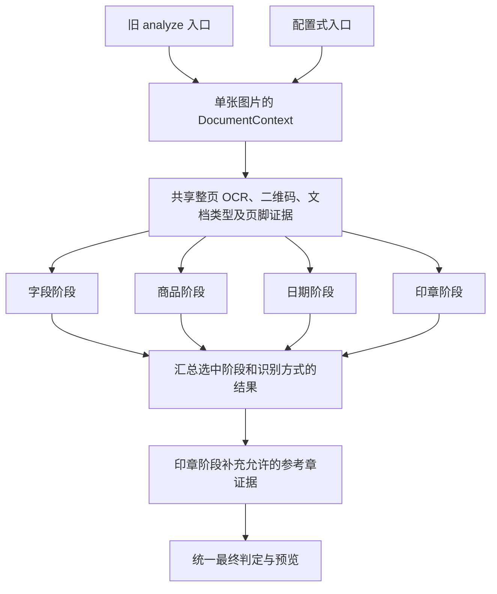

# 识别阶段拆分与统一分流

本轮把识别主流程拆成四个独立阶段，让旧入口和配置式入口使用同一套阶段、文档分流与最终判定。后台任务接口和页面操作方式保持兼容。

## 执行结构

- `analyzer.py` 从本轮修改前的约 10,000 行缩为约 135 行。它保留旧调用入口和离线审计工具使用的函数导出。
- `DocumentContext` 限定为单张图片、单次识别。每个物理 OCR 引擎的整页结果只识别一次，二维码只解码一次。返回证据副本，避免阶段之间修改同一份列表；缓存命中仍检查识别方式权限。直接调用独立阶段时也能复用上下文。
- `StageRequest` 明确传递引擎路线、字段依据、证据输出位置和印章方式。阶段只返回自己的数据、证据和复核原因，不决定整单状态。
- `stage_fields.py`、`stage_products.py`、`stage_date.py`、`stage_seal.py` 分别负责四个阶段。日期和印章的裁剪识别及规则另有专用模块。
- 配置式入口直接调用 `run_stage`，不再逐阶段进入旧 `analyze`。旧入口使用相同的阶段调度。
- `decision.finalize_result` 统一生成整体结论、最终结果及复核状态。参考章证据由印章阶段完成后再进入此入口；应用层的旧参考章函数只保留兼容委托，在线请求和后台任务不再完成识别后重新修改结论。

## 分流与行为修正

第一份成功的、已选中本地引擎的整页结果确定本次文档分流，并在其他阶段共享。后续识别方式继续提供独立的字段或区域证据；配置式汇总保留多方式冲突与失败。

| 文档 | 两个入口共同采用的规则 |
| --- | --- |
| 标准回单 | 执行选中的阶段；缺少签收页脚时保留等待续页关联的提示。 |
| 商品续页 | 只有选中的日期/印章阶段可以提取页脚证据；日期允许识别无要求日期的完整实际日期，整页仍要求关联首页复核。 |
| 委托书或未知版式 | 保留选中的字段/商品信息，不套用固定回单日期、印章模板。 |
| 仅清瞳印章识别 | 不额外调用未选中的本地 OCR，明确标记文档类型尚未验证，保留部分识别复核要求。 |

远程印章预取现在在文档分流之后开始。已确认不适用的文档不发送印章请求；允许调用时，网络请求继续与后续本地阶段重叠。纯远程印章方案无需本地分流，但不能据此判定整单通过。

部分重识别不会为了分流而执行未选择的字段解析、商品、日期裁剪或本地印章阶段。已有字段作为独立副本供日期和印章比对使用。

本轮还统一了低置信度字段规则：原配置式入口已有“表单存在低置信度字段”复核原因，现在两个入口均由最终判定模块保留这一原因。旧入口若只有非关键字段低置信度，可能因此转为人工复核。这是保守地统一原有两条规则，没有放宽通过条件。

商品阶段的结构化表格会统一回填“商品明细原文”，避免旧入口与配置式入口展示不同的同一份商品数据。

参考章匹配继续遵守现有方案边界：配置式方案没有选择参考章识别方式，因此仍不隐式追加这项识别。默认旧方案的参考章处理已移入识别流水线，并在匹配前传入原始文件名，保留排除样本自身参考章的约束。

## 验证

最终全量测试：**562 项全部通过**（66.76 秒；10 条依赖库警告）。

- 原有日期、印章、安全判定、后台任务等回归测试继续执行；旧测试只把原来针对 `analyzer` 全局依赖的模拟迁到新模块的实际使用位置。
- 新增 17 项集成检查，覆盖两个入口对四类文档的分流和结果一致性、四种部分重识别、整页/二维码复用、纯远程方案、多引擎独立证据、参考章顺序及文件名，以及低置信度字段的一致复核策略。
- 对 93 个搬迁的规则函数及裁剪识别函数做语法树对照，除移除已无用途的实例参数外，函数逻辑完全一致。
- 两张已有真实图片按交替顺序对照本轮修改前后的实现，使用相同的预热 Paddle 模型和保存的印章接口响应。字段、字段置信度、商品、日期、印章、整体结论、最终结果和复核状态均无差异。

| 样例记录 | 本轮修改前 | 本轮修改后 | 整页 OCR 次数 |
| --- | ---: | ---: | ---: |
| 1596 | 26.47 秒 | 24.86 秒 | 1 |
| 1594 | 22.15 秒 | 21.30 秒 | 1 |

这些耗时仅用于检查本轮没有明显性能退化。两张样例和单次测量不足以证明进一步提速；没有计入实际远程网络波动、模型冷启动或批量排队等待。

测试数据库、证据图片和性能对照输出均隔离保存；业务数据库只读访问，没有重新写入历史识别结果。

## 范围与生效

本轮解决了阶段入口仍调用完整主流程、文档分流不一致和在线判定分散的问题。日期裁剪和证据规则仍然复杂，只是已从整单调度中独立出来；本轮保留其顺序、阈值和冲突处理，没有重写这些业务规则。

本轮未修改界面或重启正在运行的业务服务。现有服务需正常重启后加载新代码；此前持久化的任务仍按保存的识别配置执行。
